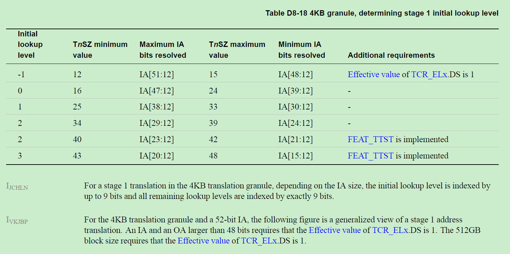
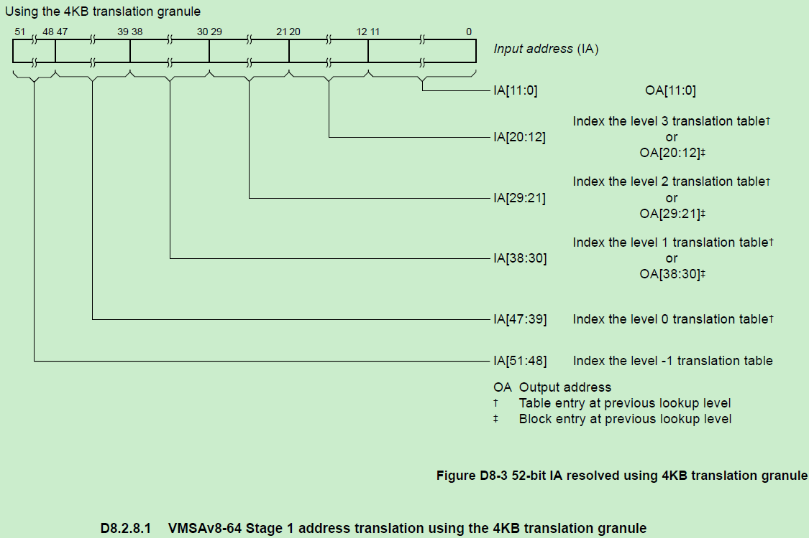
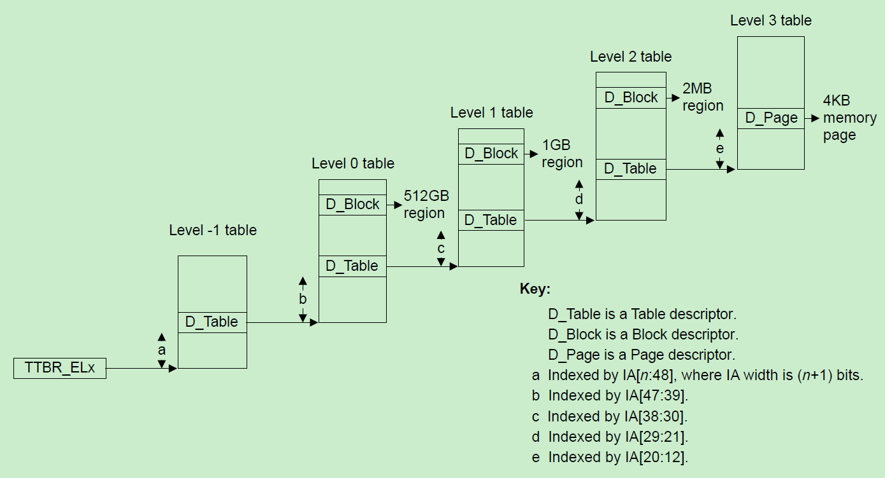
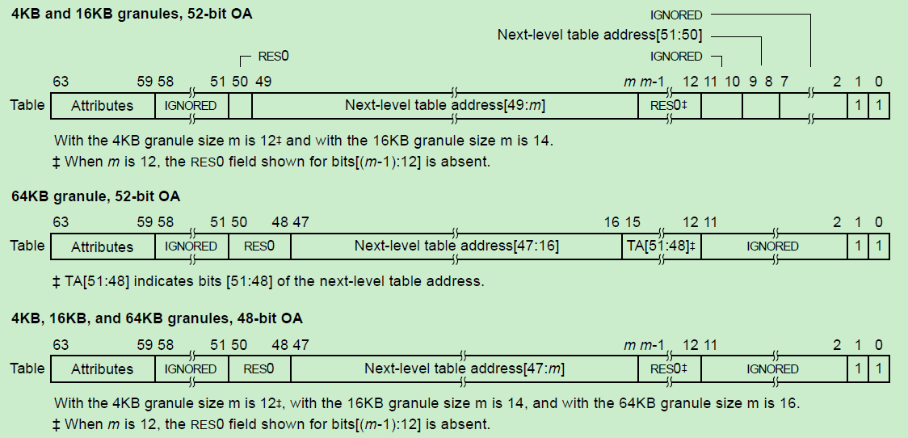
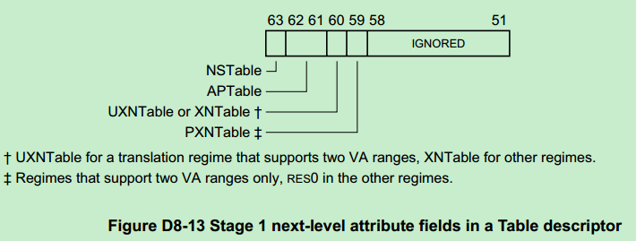
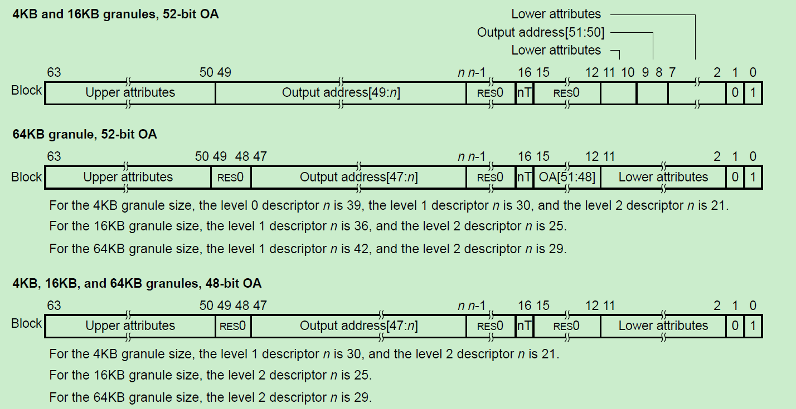
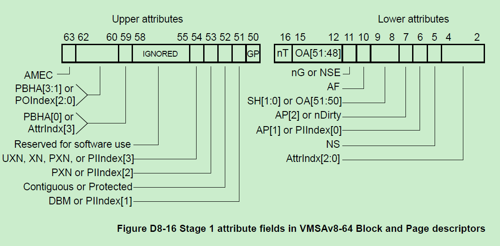
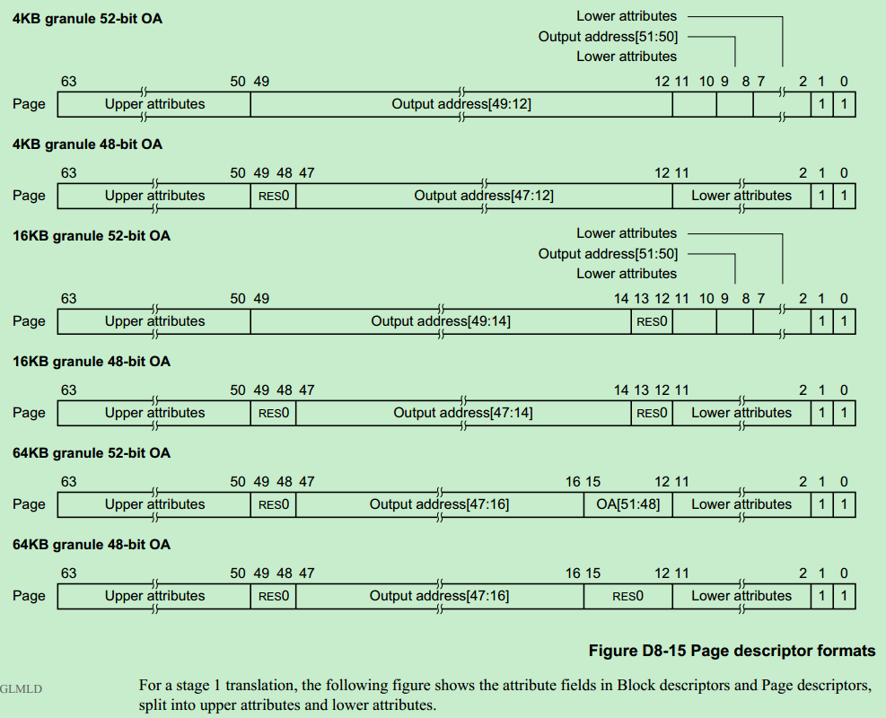
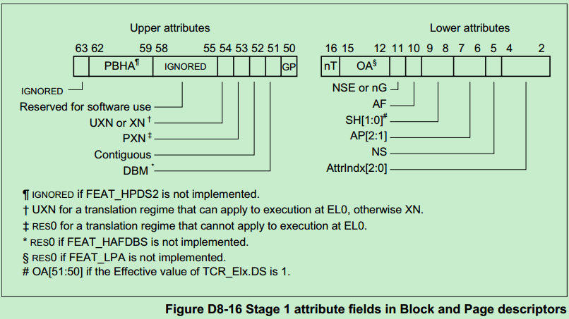
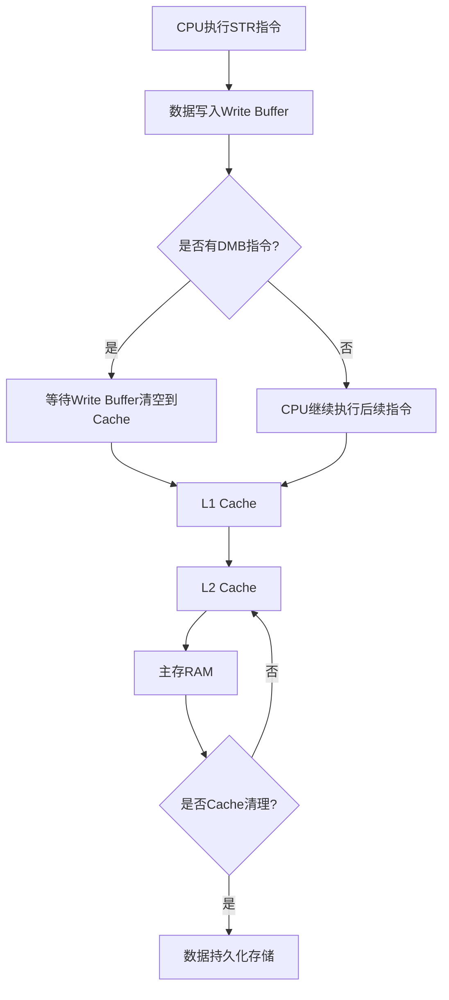

- [前言](#前言)
- [aarch64](#aarch64)
    - [寄存器：](#寄存器)
      - [常用寄存器：](#常用寄存器)
    - [cache功能项：](#cache功能项)
  - [原子性操作：](#原子性操作)
  - [中断机制](#中断机制)
    - [`Cortex-A9`：](#cortex-a9)
    - [`Cortex-A53`：](#cortex-a53)
  - [MMU](#mmu)
    - [基础知识点](#基础知识点)
      - [stage与页表层数](#stage与页表层数)
      - [TCR\_EL3](#tcr_el3)
      - [页表结构](#页表结构)
        - [页表类型](#页表类型)
        - [特权与非特权](#特权与非特权)
      - [linux相关操作](#linux相关操作)
        - [VIPT](#vipt)
        - [页表颗粒度2MB和4KB有什么差异](#页表颗粒度2mb和4kb有什么差异)
        - [VIPT](#vipt-1)
        - [页表颗粒度2MB和4KB有什么差异](#页表颗粒度2mb和4kb有什么差异-1)
  - [CPU访问流程](#cpu访问流程)
  - [数据读写流向](#数据读写流向)
  - [cache](#cache)
    - [MESI协议](#mesi协议)
      - [MESI 协议的本质：**缓存层级中的一致性协议**](#mesi-协议的本质缓存层级中的一致性协议)
      - [一句话总结：](#一句话总结)
      - [MESI example](#mesi-example)
        - [MESI 协议状态回顾](#mesi-协议状态回顾)
        - [解答分析](#解答分析)
        - [结论](#结论)
- [补充](#补充)
- [总结](#总结)

---

# 前言

本文主要描述armv8架构

---

# aarch64 
### 寄存器：
#### 常用寄存器：
 - 通用寄存器(general-purpose registers)：
有R0~R30 共计31个通用寄存器,x30通常作为LR寄存器
 <div align="center">

<p>图片1.通用寄存器</p>
</div>

 - 栈指针寄存器(`SP`)
 一个64bit栈指针寄存器

 <div align="center">

<p>图片2.SP寄存器</p>
</div>

 - 程序计数寄存器(`PC`)
 一个64bit的程序计数寄存器

 <div align="center">

<p>图片3.PC寄存器</p>
</div>

 - SIMD&FP寄存器(`SIMD&FP`)
 32个128bit的SIMD&FP操作寄存器


 <div align="center">


<p>图片4.SIMD&FP寄存器</p>
</div>

```bash
uint64_t * pinValue = 0x1000;
uint64_t * poutValue = 0x2000;
__asm__ volatile(
"ldnp q0,q1,[%[ValueIn1]]\n"
"stnp q0,q1,[%[ValueOut1]]\n"
:
:[ValueIn1]"r"(pinValue),[ValueOut1]"r"(poutValue)
:"memory","x0"
);
__asm__ volatile(
"ld4 {v0.2d,v1.2d,v2.2d,v3.2d},[%[ValueIn1]]\n"
"st4 {v0.2d,v1.2d,v2.2d,v3.2d},[%[ValueOut1]]\n"
:
:[ValueIn1]"r"(pinValue),[ValueOut1]"r"(poutValue)
:"memory","x0"
);
```

- FPCR, FPSR寄存器(`FPCR, FPSR`)
 2个64bit的SIMD&FP运算状态寄存器，存储SIMD指令及浮点运算过程中的状态

- 可伸缩矢量寄存器(`SVE`)
 32个128bit的SIMD&FP操作寄存器，用于SIMD指令及浮点运算


 <div align="center">

<p>图片4.SIMD&FP寄存器</p>
</div>

### cache功能项：
 - Cache type寄存器(`Cache Type Register`)
主要功能如下：
	- 任何受指令缓存维护指令影响的指令缓存的最小行长度。
	- 任何受数据缓存维护指令影响的数据或统一缓存的最小行长度。
	- 一级指令缓存的缓存索引和标记策略。

 <div align="center">


<p>图片5.cache type 寄存器</p>
</div>

## 原子性操作：

 - 对齐的LDR、STR为single-copy atomic
   - 单次加载/存储操作不可分割
   - 支持最大64bit数据宽度（8字节）
   - 适用于：指针操作、基本数据类型访问
   - 示例：`LDR X0, [X1]` / `STR X0, [X1]`

 - 对齐的LDNP、STNP为2次single-copy atomic
   - 每次操作实际执行两个独立的8字节访问
   - 支持128bit数据宽度（16字节）
   - 不保证两个8字节操作的原子顺序
   - 适用于：流式数据操作、非关键数据块拷贝
   - 示例：`LDNP Q0, Q1, [X2]` / `STNP Q0, Q1, [X3]`

## 中断机制

```c
ADD R0, R1, R2    ; 假设执行这条指令时触发中断
MOV R3, #1        ; 下一条指令
```
在Cortex-A53/A9中，当执行ADD指令时发生中断：

对ADD指令的处理有**两种**可能：

1.如果ADD已经进入执行阶段(Execute stage)，则会**执行完成**
2.如果ADD还在译码或更早的流水线阶段，则可能会被**取消(canceled)并重新执行**


关于**LR**值的设置：

如果ADD指令被完整执行了，**LR**会指向MOV指令的地址
如果ADD指令被取消了，**LR**会指向ADD指令的地址


这种行为设计的原因是：

保证指令的原子性
确保中断返回后能够正确恢复执行
维护处理器状态的一致性

### `Cortex-A9`：


采用经典的ARMv7-A架构
支持精确中断机制
使用6-8级流水线
**当中断发生时**：

1. 完成当前指令执行
2. LR = PC - 4（对于IRQ/FIQ，指向MOV）(ps:若未完成时,LR指向ADD指令)
3. 支持虚拟化扩展（可选）

### `Cortex-A53`：
采用ARMv8-A架构
同样支持精确中断
使用8级流水线
提供了更多的异常等级（EL0-EL3）
**当中断发生时**：

1. 完成当前指令执行
2. LR = PC - 4（在AArch32模式下）
3. 在AArch64模式下，使用ELR_ELx寄存器保存返回地址
4. 支持更复杂的异常处理机制
## MMU

### 基础知识点

#### stage与页表层数

**一、Stage 是指转换阶段，不是页表层数**

- **Stage 1 Translation**：

  虚拟地址（VA） → 中间物理地址（IPA，Intermediate Physical Address，EL1/EL3时就是物理地址）

  普通应用、内核、EL3固件**大部分情况只用 Stage 1**

- **Stage 2 Translation**：

  IPA → 物理地址（PA）

  只有虚拟化（EL2/Hypervisor）场景才需要，Guest VA 先经过 Guest OS 的 Stage 1，再经过 Hypervisor 的 Stage 2 才到物理地址

**所以：**

- **如果你是 EL3 固件（TCR_EL3 配置），只有 Stage 1**

- 如果你是 EL2 Hypervisor，可有 Stage 1 (TCR_EL2) 和 Stage 2 (VTCR_EL2)

- 如果你是 EL1 内核，只有 Stage 1（除非被虚拟化）

**二、页表“几级”取决于 T0SZ/VA 大小/粒度**

在确定 Stage = 1 or 2 之后，还要看 这个 Stage 的页表是几级。
ARMv8 64 位地址翻译，最多 4 级页表，每级映射 9bit 地址空间（512 个 PTE）。

**算法：**

1. 确定虚拟地址位数：**VA_bits = 64 - T0SZ（TCR_ELx.T0SZ）**
2. 每级页表提供 **9bit** × **页表基本寻址单元** 大小的寻址空间
3. 64位架构，一个页表项占8byte空间，一个页表占**512×8Byte**空间
4. MMU 页表中的低位不用于存储地址，这导致了页表地址必须**对齐**到某个**特定的边界**，比如2^12(4096)Byte
5. 页大小由 [TGX](#register_tcr_tg0) 决定（4KB = 12bit offset）

6. 公式：
    ```ini
      N = ceil((VA_bits - page_offset_bits) / 9)
      page_offset_bits = 12 (4KB), 14 (16KB), 16 (64KB)
    ```

**例子：**

- 如果 T0SZ = 24 → VA_bits = 40，页大小 4KB（12bit offset）：
  ```ini
  N = ceil((40-12)/9) = ceil(28/9) = 4
  → 4 级页表
  ```
- 如果 T0SZ = 32 → VA_bits = 32，页大小 4KB：
    ```ini
    N = ceil((32-12)/9) = ceil(20/9) = 3
    → 3 级页表
    ```
- 如果 T0SZ = 39 → VA_bits = 25，页大小 4KB：
    ```ini
    N = ceil((25-12)/9) = ceil(13/9) = 2
    → 2 级页表
    ```

#### TCR_EL3

**Translation Control Register EL3**


- 用途（Purpose）
用于控制 EL3 级别第一阶段地址转换的寄存器。

- 配置（Configuration）
仅当实现了 EL3 时此寄存器才存在。否则，任何对 TCR_EL3 的直接访问都是未定义的（UNDEFINED）。

- 属性（Attributes）
TCR_EL3 是一个 64 位寄存器


| 位号 (bit) | 字段名    | 作用/描述 (简要)                               |
| -------- | ------ | ---------------------------------------- |
| \[63:44] | -      | 保留，写0 (RES0)                             |
| 43       | DisCH0 | 禁用起始页表描述符 Contiguous 位 (FEAT\_D128)      |
| 42       | HAFT   | 硬件管理表描述符访问标志 (FEAT\_HAFT)                |
| 41       | PTTWI  | 页表遍历弱一致性 (FEAT\_THE)                     |
| \[40:39] | -      | 保留，写0 (RES0)                             |
| 38       | D128   | 启用 VMSAv9-128 翻译 (FEAT\_D128)            |
| 37       | AIE    | 属性索引扩展 (FEAT\_AIE)                       |
| 36       | POE    | 权限叠加 (FEAT\_S1POE)                       |
| 35       | PIE    | 间接权限模型 (FEAT\_S1PIE)                     |
| 34       | PnCH   | Protected 属性支持 (FEAT\_THE)               |
| 33       | MTX    | 内存标记检查控制 (MTE 相关)                        |
| 32       | DS     | LPA2 支持 / 52位物理地址 / T0SZ限制               |
| 31       | -      | 保留，写1 (RES1)                             |
| 30       | TCMA   | MTE unchecked 模式 (FEAT\_MTE2)            |
| 29       | TBID   | TBI 对指令访问控制 (PAuth 相关)                   |
| 28       | HWU62  | 硬件页表位可用 (FEAT\_HPDS2)                    |
| 27       | HWU61  | 硬件页表位可用 (FEAT\_HPDS2)                    |
| 26       | HWU60  | 硬件页表位可用 (FEAT\_HPDS2)                    |
| 25       | HWU59  | 硬件页表位可用 (FEAT\_HPDS2)                    |
| 24       | HPD    | 禁用层级权限 (Hierarchical Permission Disable) |
| 23       | -      | 保留，写1 (RES1)                             |
| 22       | HD     | 硬件脏位 (FEAT\_HAFDBS)                      |
| 21       | HA     | 硬件访问标志更新 (FEAT\_HAFDBS)                  |
| 20       | TBI    | 顶字节忽略 (Tagged Address)                   |
| 19       | -      | 保留，写0 (RES0)                             |
| \[18:16] | PS     | 物理地址大小 (32 \~ 56 位)                      |
| \[15:14] | TG0    | TTBR0\_EL3 页粒度 (4K/16K/64K)              |
| \[13:12] | SH0    | 页表共享属性 (Non/Outer/Inner)                 |
| \[11:10] | ORGN0  | 外层缓存策略                                   |
| \[9:8]   | IRGN0  | 内层缓存策略                                   |
| \[7:6]   | -      | 保留，写0 (RES0)                             |
| \[5:0]   | T0SZ   | 虚拟地址空间大小控制 (VA size = 2^(64-T0SZ))       |

[TCR_EL3 Bit详解](#tcrel3_bit_meaning)

#### 页表结构


##### 页表类型
在 arm64/cortex-A53下,`MMU`根据**颗粒度**大小(`granule`),将表分为多级，包括**Table**、**Block**(2MB)、**Page**(4KB).最终通过一个**虚拟地址**通过查表获取对应的**物理地址**(虚拟地址不同bit分区作为MMU Table的索引)
| Descriptor Type | 描述 | 用途 | 映射大小 |
|-----------------|------|------|----------|
| Table           | 指向下一级页表的表格描述符 | 用于多级页表结构，链接到下一级表 | 不直接映射物理内存，指向下一级页表 |
| Block           | 映射一段连续物理内存的块描述符 | 用于较大内存区域，直接映射，不进入下一级表 | Level 0: 512 GB<br>Level 1: 1 GB<br>Level 2: 2 MB |
| Page            | 映射单个页面的页描述符 | 用于精细的页面映射 | 4 KB / 16 KB / 64 KB（取决于配置） |


EL3_stage1 最多支持5级别页表,最后一个表为**block&page**


<div style="text-align: center;">
    
</div>
<div style="text-align: center;">
    
</div>
<div style="text-align: center;">
    
</div>

**Table Descriptor Format**:

<div style="text-align: center;">
    
</div>
<div style="text-align: center;">
    
</div>


| 位段         | 字段 / 值         | 条件 / 说明 |
|--------------|-------------------|-------------|
| [63]         | RES0 / NSTable     | 非安全状态为 RES0；安全状态为 NSTable。详见 *Hierarchical control of Secure or Non-secure memory accesses*。 |
| [62:61]      | APTable[1:0]       | 启用层级权限时有效；若 `HCR_EL2.{NV,NV1}=={1,1}`，则 `APTable[0]=0`。详见 *Hierarchical control of data access Direct permissions*。 |
| [60]         | XNTable / UXNTable / PXNTable | 在第1阶段（Stage 1）地址转换中，某一查找级别（lookup level）的页表项可以限制后续查找级别中使用直接权限（Direct permissions）所表达的指令执行控制 [XN详解](#Execute_never_supplement)|
| [59]         | RES0 / PXNTable    | 启用层级权限时：单特权级或 EL1&0 且 `HCR_EL2.{NV,NV1}=={1,1}` 为 RES0；双特权级为 PXNTable。 |
| [58:53]      | IGNORED            | 忽略。 |
| [52]         | Protected / IGNORED| 当 `PnCH=1` 时为 Protected；否则忽略。详见 *Stage 1 Protected Attribute*。 |
| [51]         | IGNORED            | 忽略。 |
| [50]         | RES0               | 保留为 0。 |
| [49:48]      | RES0 / NLTA[49:48] | 4KB/16KB 且 DS=0 或 64KB 粒度为 RES0；4KB/16KB 且 DS=1 为 NLTA[49:48]。 |
| [47:12]      | NLTA[...]          | 4KB 粒度：NLTA[47:12]；16KB 粒度：NLTA[47:14]（bits[13:12] 为 RES0）；64KB 粒度：NLTA[47:16]（未实现 LPA）；64KB+LPA：NLTA[47:16]+NLTA[51:48]。 |
| [11]         | IGNORED            | 忽略。 |
| [10]         | Access flag (AF) / IGNORED | 硬件管理 AF 启用时为 Access flag，否则忽略。详见 *Hardware management of the Table descriptor Access Flag*。 |
| [9:8]        | IGNORED / NLTA[51:50] | 4KB/16KB 且 DS=0 或 64KB 粒度为忽略；4KB/16KB 且 DS=1 为 NLTA[51:50]。 |
| [7:2]        | IGNORED            | 忽略。 |
| [1]          | Table descriptor   | 为 1 表示是表描述符（适用于 L3 以上）。 |
| [0]          | Valid descriptor   | 为 1 表示描述符有效。 |


**Block Descriptor Format**:

<div style="text-align: center;">
    
</div>
<div style="text-align: center;">
    
</div>

**Lower Attributes [0:1]**
|Bits [1:0]	|Type	|Meaning|
|-|-|-|
|0b00|Invalid|这个页表项无效。如果 MMU 尝试访问这个条目，会触发一个 转换错误（translation fault）。通常用于表示未映射或无效的内存区域。|
|0b01|Block or Page|这个页表项是一个 块（Block） 或 页（Page） 的描述符。这意味着地址转换在这里结束，页表项的其余部分直接包含了 物理地址 和 内存属性。|
|0b10|Reserved|这个值被保留给未来的用途，如果 MMU 遇到这个值，也会触发一个转换错误。|
|0b11|Table|这个值被保留给未来的用途，如果 MMU 遇到这个值，也会触发一个转换错误。|

**Lower Attributes [2:15]**

| 位范围    | 字段名       | 含义说明 |
|-----------|--------------|----------|
| [4:2]     | AttrIndx[2:0] | 内存属性索引，对应 MAIR_ELx，定义缓存策略和内存类型（Device/Normal） |
| 5         | NS            | Non-secure bit：标记为安全世界或非安全世界（TrustZone） |
| [7:6]     | AP[1:0]       | 访问权限：用户态/特权态，读/写 权限设置 |
| [9:8]     | SH[1:0]       | 共享域设置：Non-shareable、Inner-shareable、Outer-shareable [bit详解](#sh_bit_meaning)|
| 10        | AF            | Access Flag：是否已访问（硬件/软件置位） |
| 11        | nG            | not-Global：设置是否是全局页，影响 TLB 是否与 ASID 绑定 |
| [15:12]   | OA[51:48]     | 输出物理地址高位部分（配合页基地址） |


**Upper Attributes [50:63]**

| 位范围    | 字段名            | 含义说明 |
|-----------|-------------------|----------|
| 50        | GP                | Guarded Page（或其他特殊用途，常忽略） |
| 51        | DBM / PI[1]       | Dirty Bit Modify 支持，用户态可写标志 |
| 52        | Contiguous        | 支持页连续优化，用于 TLB 合并 |
| 53        | PXN / PI[2]       | Privileged Execute Never：禁止 EL1 执行 |
| 54        | UXN / PI[3]       | Unprivileged Execute Never：禁止 EL0 执行 |
| [58:55]   | Reserved/Software | 供软件使用或保留 |
| 59        | PBHA[0] / AttrIndx[3] | Page Based Hardware Attributes，平台相关 |
| [62:60]   | PBHA[3:1] / POIndex[2:0] | 同上，QoS / Cache Hint 用 |
| 63        | AMEC              | Allocation Management Enable Code，硬件或平台使用 |


**Page Descriptor Format**:

<div style="text-align: center;">
    
</div>
<div style="text-align: center;">
    
</div>


**Output Address 的实际含义**
- Output Address 代表了虚拟地址转换后的 物理地址基址。

- 在 MMU 的页表查找过程中，每个页表项（`Page descriptor` 或 `Block descriptor`）都会包含这个字段。当 MMU 找到一个有效的页表项时，它会执行以下操作：

- 拼接物理地址: MMU 会将页表项中的 Output Address 字段，与虚拟地址中未被页表使用的低位部分（即页内偏移量）**拼接**起来。

生成最终的物理地址: 拼接后的结果就是 CPU **最终要访问的物理地址**。


**Page Descriptor Format**:

<div style="text-align: center;">
    
</div>
<div style="text-align: center;">
    
</div>


**Output Address 的实际含义**
- Output Address 代表了虚拟地址转换后的 物理地址基址。

- 在 MMU 的页表查找过程中，每个页表项（`Page descriptor` 或 `Block descriptor`）都会包含这个字段。当 MMU 找到一个有效的页表项时，它会执行以下操作：

- 拼接物理地址: MMU 会将页表项中的 Output Address 字段，与虚拟地址中未被页表使用的低位部分（即页内偏移量）**拼接**起来。

生成最终的物理地址: 拼接后的结果就是 CPU **最终要访问的物理地址**。

##### 特权与非特权
| 术语               | 中文含义  | 描述                       |
| ---------------- | ----- | ------------------------ |
| **Privileged**   | 特权模式  | 操作系统核心、驱动代码运行的模式，权限最高    |
| **Unprivileged** | 非特权模式 | 用户态程序运行的模式，权限受限，不能直接访问硬件 |

| EL级别 | 运行模式           | 典型用途           | 是否特权模式            |
| ---- | -------------- | -------------- | ----------------- |
| EL3  | Secure Monitor | TrustZone 安全监控 | ✅ 是               |
| EL2  | Hypervisor     | 虚拟化支持          | ✅ 是               |
| EL1  | Kernel / OS    | 操作系统内核         | ✅ 是               |
| EL0  | User Space     | 应用程序           | ❌ 否（Unprivileged） |


| 对比项             | Unprivileged (EL0) | Privileged (EL1+) |
| --------------- | ------------------ | ----------------- |
| 是否能访问系统寄存器      | ❌ 否                | ✅ 是               |
| 是否能修改页表或MMU     | ❌ 否                | ✅ 是               |
| 是否能执行异常处理       | ❌ 否                | ✅ 是               |
| 是否可执行SVC（软件中断）  | ✅ 可以请求服务           | ✅ 可以处理            |
| 是否可执行 `WFI/WFE` | ❌ 否                | ✅ 是               |
| 能否开启/关闭中断       | ❌ 否                | ✅ 是               |
| 常见用途            | 用户程序（shell、APP）    | 内核、驱动、异常处理等       |


总结一句话：
Privileged 是“特权态”用于操作系统和核心控制逻辑；Unprivileged 是“用户态”，用于运行用户应用，受到严格限制，防止破坏系统稳定性。

在**ARM64**上:

- TTBR0_EL1: 指向**用户**空间**页表基地址**
- TTBR1_EL1: 指向**内核**空间**页表基地址**
- 每个进程都有自己的**用户空间页表**(`TTBR0`)
- 所有进程共享同一个**内核页表**(`TTBR1`)

#### linux相关操作

Linux 通常采用四级页表结构:

- PGD (Page Global Directory)
- PUD (Page Upper Directory)
- PMD (Page Middle Directory)
- PTE (Page Table Entry)

```c
页表切换过程
switch_mm() {
    // 1. 获取新进程的页表基地址
    pgd = next->mm->pgd;
    
    // 2. 切换TTBR0寄存器
    write_ttbr0(pgd);
    
    // 3. 刷新TLB
    flush_tlb_local();  // 清除旧进程的TLB项
    
    // 4. 更新ASID(Address Space ID)
    if (prev_asid != next_asid) {
        update_asid(next_asid);
    }
}

```
内存管理的关键概念：

- 每个进程有独立的虚拟地址空间
- 内核空间在所有进程中映射相同
- 使用ASID来避免切换时完全刷新TLB
- 页表项包含访问权限、缓存属性等标志位


##### VIPT

**VIPT (Virtually Indexed, Physically Tagged)**

`VIPT` 是一种优化后的寻址策略，旨在解决 PIPT 的性能瓶颈
- **工作原理**: CPU 发出的 虚拟地址 的一部分（通常是低位）直接用于缓存的 索引（Index）。这意味着缓存查找可以与 MMU 查找并行进行。当 MMU 的转换结果（物理地址）返回时，缓存使用这个物理地址的标签（Tag）部分进行验证。

- 优点:

    - **高性能**: 由于 `MMU` 查找和缓存索引查找可以同时进行，这极大地减少了内存访问延迟。这是 `VIPT` 最主要的优势。

    - **复杂性**: VIPT 的设计需要特别注意，因为不同的虚拟地址可能映射到同一个物理地址（**同义词**问题），而同一个虚拟地址也可能映射到不同的物理地址（**异义词**问题）。

##### 页表颗粒度2MB和4KB有什么差异
---

当你访问 2MB 或 4KB 内存块内的某个字节时，从 MMU 的角度看，地址转换的粒度不同，但从 CPU 访问数据的角度看，差异主要在于**缓存的行为**。

**MMU 的视角**：地址转换<br>
MMU 的最小转换粒度是 4KB，这是指 MMU 最小能将物理内存划分为 4KB 大小的块，并为每个块分配独立的地址和属性。

- 访问 **4KB 块内的字节**：当 CPU 访问 4KB 块内的任何字节时，MMU 会查找 L3/L4 页表，找到对应的 4KB 页表项，然后根据页表项中的物理地址和属性来完成转换。

- 访问 **2MB 块内的字节**：当 CPU 访问 2MB 块内的任何字节时，MMU 只需查找 L2 页表。找到对应的 2MB 块描述符后，MMU 会直接完成地址转换，而不需要继续查找下一级页表。

从 MMU 的角度来看，主要区别在于 查找的层级不同。访问 2MB 块内的字节通常更快，因为 MMU 只需进行一次查找，而不需要像访问 4KB 块那样进行多次查找（例如，从 L1 查到 L2，再查到 L3）。


**CPU 的视角：缓存和数据访问**<br>
无论 MMU 的转换粒度是 2MB 还是 4KB，CPU 访问数据的最小单位都是 **缓存行（Cache Line）**，通常为 64 字节。

当 CPU 访问内存中的某个字节时，它不会只读取那个字节，而是会执行以下操作：

1. 缓存查找：CPU 会首先在 L1 缓存中查找所需的数据。

2. 缓存未命中：如果数据不在缓存中，CPU 会通过 MMU 转换虚拟地址，然后从物理内存中获取包含该字节的整个缓存行（64 字节），并将其加载到 L1 缓存中。

这个过程与 MMU 的页表粒度没有直接关系。无论是 2MB 块还是 4KB 页，CPU 都会以缓存行作为最小单位来传输数据。

**核心区别：缓存的有效性与一致性**<br>
2MB 和 4KB 映射的主要区别在于 **对缓存的影响**，特别是在 **VIPT（虚拟索引，物理标签）** 缓存寻址模式下：

- **2MB Block 映射**：由于 2MB 的虚拟地址和物理地址有 20 位（2^20）的偏移量，这可能会导致 缓存同义词（synonym） 问题。两个不同的虚拟地址可能映射到同一个 2MB 物理地址块，从而在缓存中产生歧义。为了解决这个问题，操作系统需要确保这种地址映射不会发生，或者通过其他机制来保证缓存一致性。

- **4KB Page 映射**：如果缓存的索引大小小于 4KB，那么不同虚拟地址映射到同一物理地址的问题就不会出现。这简化了缓存管理，但在某些情况下，如果需要映射大块的连续内存，会占用更多的页表空间。

**总结：**<br>
尽管2MB的block可以提高性能并节省页表空间，但它只适用于映射大块的、连续的、且具有相同访问属性的物理内存，比如DDR。<br>
而4KB的page则提供了精细的内存管理、强大的安全保护和高效的内存利用，这些是构建复杂操作系统所必不可少的能力。因此，两种粒度的页表都是现代计算机体系结构中不可或缺的。

##### VIPT

**VIPT (Virtually Indexed, Physically Tagged)**

`VIPT` 是一种优化后的寻址策略，旨在解决 PIPT 的性能瓶颈
- **工作原理**: CPU 发出的 虚拟地址 的一部分（通常是低位）直接用于缓存的 索引（Index）。这意味着缓存查找可以与 MMU 查找并行进行。当 MMU 的转换结果（物理地址）返回时，缓存使用这个物理地址的标签（Tag）部分进行验证。

- 优点:

    - **高性能**: 由于 `MMU` 查找和缓存索引查找可以同时进行，这极大地减少了内存访问延迟。这是 `VIPT` 最主要的优势。

    - **复杂性**: VIPT 的设计需要特别注意，因为不同的虚拟地址可能映射到同一个物理地址（**同义词**问题），而同一个虚拟地址也可能映射到不同的物理地址（**异义词**问题）。

##### 页表颗粒度2MB和4KB有什么差异
---

当你访问 2MB 或 4KB 内存块内的某个字节时，从 MMU 的角度看，地址转换的粒度不同，但从 CPU 访问数据的角度看，差异主要在于**缓存的行为**。

**MMU 的视角**：地址转换<br>
MMU 的最小转换粒度是 4KB，这是指 MMU 最小能将物理内存划分为 4KB 大小的块，并为每个块分配独立的地址和属性。

- 访问 **4KB 块内的字节**：当 CPU 访问 4KB 块内的任何字节时，MMU 会查找 L3/L4 页表，找到对应的 4KB 页表项，然后根据页表项中的物理地址和属性来完成转换。

- 访问 **2MB 块内的字节**：当 CPU 访问 2MB 块内的任何字节时，MMU 只需查找 L2 页表。找到对应的 2MB 块描述符后，MMU 会直接完成地址转换，而不需要继续查找下一级页表。

从 MMU 的角度来看，主要区别在于 查找的层级不同。访问 2MB 块内的字节通常更快，因为 MMU 只需进行一次查找，而不需要像访问 4KB 块那样进行多次查找（例如，从 L1 查到 L2，再查到 L3）。


**CPU 的视角：缓存和数据访问**<br>
无论 MMU 的转换粒度是 2MB 还是 4KB，CPU 访问数据的最小单位都是 **缓存行（Cache Line）**，通常为 64 字节。

当 CPU 访问内存中的某个字节时，它不会只读取那个字节，而是会执行以下操作：

1. 缓存查找：CPU 会首先在 L1 缓存中查找所需的数据。

2. 缓存未命中：如果数据不在缓存中，CPU 会通过 MMU 转换虚拟地址，然后从物理内存中获取包含该字节的整个缓存行（64 字节），并将其加载到 L1 缓存中。

这个过程与 MMU 的页表粒度没有直接关系。无论是 2MB 块还是 4KB 页，CPU 都会以缓存行作为最小单位来传输数据。

**核心区别：缓存的有效性与一致性**<br>
2MB 和 4KB 映射的主要区别在于 **对缓存的影响**，特别是在 **VIPT（虚拟索引，物理标签）** 缓存寻址模式下：

- **2MB Block 映射**：由于 2MB 的虚拟地址和物理地址有 20 位（2^20）的偏移量，这可能会导致 缓存同义词（synonym） 问题。两个不同的虚拟地址可能映射到同一个 2MB 物理地址块，从而在缓存中产生歧义。为了解决这个问题，操作系统需要确保这种地址映射不会发生，或者通过其他机制来保证缓存一致性。

- **4KB Page 映射**：如果缓存的索引大小小于 4KB，那么不同虚拟地址映射到同一物理地址的问题就不会出现。这简化了缓存管理，但在某些情况下，如果需要映射大块的连续内存，会占用更多的页表空间。

**总结：**<br>
尽管2MB的block可以提高性能并节省页表空间，但它只适用于映射大块的、连续的、且具有相同访问属性的物理内存，比如DDR。<br>
而4KB的page则提供了精细的内存管理、强大的安全保护和高效的内存利用，这些是构建复杂操作系统所必不可少的能力。因此，两种粒度的页表都是现代计算机体系结构中不可或缺的。

## CPU访问流程

**CPU取指令阶段:**


CPU首先获取程序计数器(PC)中的**虚拟地址**
这个**虚拟地址**需要被转换为物理地址才能访问实际的内存


地址转换过程:

- 首先检查`TLB(Translation Lookaside Buffer)`:

    - CPU会先查找TLB缓存
    - TLB条目包含`ASID(Address Space ID)`和虚拟地址到物理地址的映射
    - `ASID`用于区分不同进程的地址空间,避免TLB刷新
    - 如果找到匹配的`TLB`条目(`TLB hit`),直接使用缓存的物理地址

-  TLB未命中时的页表遍历:

    - CPU读取`TTBR(Translation Table Base Register)`获取页表基地址
    - 对于ARM架构通常是两级页表结构
    - 使用虚拟地址的不同位段索引页表
    - 最终得到物理页框号(PFN)


**Cache访问:**


得到物理地址后,先检查Cache
- 现代CPU通常采用`VIPT(Virtually Indexed Physically Tagged)Cache`
- Cache使用虚拟地址的低位作为索引,物理地址作为Tag
- 如果Cache命中,直接返回数据
- Cache缺失则需要访问内存


**实际执行过程中的优化:**


- CPU会进行指令预取,填充指令Cache
- 分支预测会提前计算可能用到的地址
- MMU包含micro-TLB专门用于指令地址转换
- Cache和TLB并行查询以提高性能

**这个过程涉及几个关键组件的协同工作:**

- ASID确保每个进程有独立的地址空间视图
- TTBR指向当前进程的页表结构
- TLB缓存最近使用的地址转换结果
- Cache系统隐藏内存访问延迟

**当进程切换时:**

- 需要更新TTBR指向新进程的页表
- 可能需要刷新TLB(除非使用ASID)
- Context Switch会影响Cache性能

**这些机制共同保证了虚拟内存的正确性和性能。每个组件都针对特定问题提供优化:**

- ASID解决进程隔离问题
- TLB解决地址转换速度问题
- Cache解决内存访问延迟问题


MMU中可配置cache属性。某块RAM配置了cacheable属性，若存放了指令，则会使用Icache，若触发了访问，则会使用Dcache。


## 数据读写流向



数据流向说明：

- **CPU执行STR指令阶段**：
  - 数据首先进入Write Buffer（合并缓冲区）
  - 处理器继续执行后续指令（非阻塞）
  - 写操作完成状态立即对当前CPU可见

- **Write Buffer到Cache阶段**：
  - 异步写入L1 D-Cache（由硬件调度）
  - 写入策略：
    - 默认：合并相邻写操作（Write Merging）
    - 遇到DMB指令：强制排空Write Buffer
    - 遇到DSB指令：确保数据到达目标存储位置

- **Cache层级同步**（Write-Back策略）：
  ```mermaid
  flowchart LR
    L1D-->|Eviction|L2
    L2-->|Eviction|L3
    L3-->|Eviction|RAM
  ```
  - 触发条件：
    - Cache替换策略触发（LRU等）
    - 显式Clean/Invalidate操作
    - 一致性协议请求（如多核间缓存一致性）

带内存屏障的写操作：
```c
STR R1, [R0]    // 1. 数据进入Write Buffer
DMB             // 2. 确保所有存储操作在继续前完成
                // 3. 清空Write Buffer到L1 D-Cache
```


带Cache清理的写操作：
```c
STR R1, [R0]    // 1. 数据进入Write Buffer
DSB             // 2. 等待所有存储完成（包括Cache到内存）
DC CIVAC, X0    // 3. 清理并无效化Cache行（ARMv8指令）
```

对开发者的影响：
- **常规场景**：
  - 利用Write Buffer提升性能
  - 自动缓存管理
  
- **关键场景**：
  - DMA操作前：必须Clean Cache
  - 多核共享数据：需要DMB+Cache维护
  - 内存映射I/O：使用Device-nGnRnE内存类型

## cache

### MESI协议

#### MESI 协议的本质：**缓存层级中的一致性协议**

> MESI 是一种 **缓存行级别（cache line level）** 的一致性协议，  
> 它只在**共享同一物理内存的多个处理器核之间**生效。

**它的目标**：
在多核系统中，确保：
- 任意一个物理内存地址（cache line）
- 在多个 CPU 核的私有缓存中
- 无论哪个核修改、读取该地址
👉 所有核最终都能看到 **同样的数据值（Coherency）**

---

**MESI 协议的限定范围（Scope）**

| 层次 | 是否在 MESI 控制范围内 | 说明 |
|------|------------------|------|
| **L1、L2 私有缓存** | ✅ 在范围内 | 每个核心的私有缓存（Data/Instruction）通过 MESI 保持一致性 |
| **多核之间共享的缓存（如 L3）** | ✅ 在范围内 | 通常由共享缓存的目录或 snoop 协议实现一致性 |
| **主内存（DRAM）** | ✅ 间接涉及 | 缓存失效或写回时同步主存数据 |
| **DMA 外设、I/O 映射内存** | 🚫 不在范围内 | 外设访问绕过 CPU 缓存，需要通过 DSB/DMB 或 cache flush 保证一致性 |
| **不同 SoC / 不同 NUMA 节点之间** | 🚫 不在范围内 | 超出单个一致性域（coherency domain），需要软件/协议层保证 |
| **指令执行顺序 / 可见性顺序** | 🚫 不在范围内 | 由内存屏障（DMB/DSB/ISB）或内存模型保证 |

---

**换句话说：**
MESI 维护的是：
> “多个核心对**同一 cache line** 的拷贝是否一致”

它**不保证**：
> “不同 cache line（不同变量）之间的访问顺序”

---

**MESI 协议作用的“域”——一致性域 (Coherency Domain)**

在硬件系统设计中，我们通常定义一个 **Coherency Domain**：

```
+-------------------------------------+
|           Coherency Domain          |
|-------------------------------------|
|   CPU Core 0   + L1/L2 cache (MESI) |
|   CPU Core 1   + L1/L2 cache (MESI) |
|   CPU Core 2   + L1/L2 cache (MESI) |
|   Shared L3 / Snoop / Directory     |
+-------------------------------------+
           |
           ↓
        DRAM 控制器
```

- MESI 协议只在 **这个域内部** 工作；
- 域外（如外设 DMA、PCIe、GPU、另一 SoC）**不会参与 MESI 协议**；
- 因此访问域外设备需要：
  - 显式 Cache Flush；
  - 或内存屏障；
  - 或使用 “Device memory” 类型的非缓存访问。

---

**为什么有限定范围：硬件成本与可扩展性**

维护 MESI 协议需要：
- 每个核心在总线上监听（Snoop Bus）
- 或维护一张目录（Directory Cache）
- 并处理大量一致性消息（Invalidate、ReadReq、WriteBack 等）

当核数增加时：
- 总线广播和目录开销呈 **平方级增长**
- 因此 MESI 通常只用于：
  - 单个 SoC；
  - 或 NUMA 节点内部；
  - 典型规模 ≤ 8~16 核。

对于更大规模系统：
- 会采用 **目录式一致性协议（Directory-based MESI/MOESI）**
- 或更高层协议（CC-NUMA、CXL.cache 等）

---

**总结：MESI 的作用边界与不负责的部分**

| 范围 | MESI 是否负责 | 示例 |
|------|----------------|------|
| 同一 SoC 内多核缓存一致 | ✅ 负责 | Core0 写入变量 A，Core1 读取可见 |
| 变量访问顺序、同步关系 | 🚫 不负责 | 需 DMB/DSB/ISB 屏障控制 |
| 外设 / DMA 缓存一致性 | 🚫 不负责 | 需 cache flush 或 non-cacheable 区域 |
| 不同主机或 NUMA 节点 | 🚫 不负责 | 需软件或目录协议维护 |
| 同步原语（锁、信号量）语义 | 🚫 不负责 | 需依靠 CPU 的 memory model |

---

**存储 MESI 状态的结构**


1. 缓存的内部结构

一个缓存（Cache）通常被逻辑上分成两个主要部分：

| 部分 | 存储内容 | 包含 MESI 状态吗？ |
|:---|:---|:---|
| **标签数组 (Tag Array)** | 地址标签 (Tag)、有效位 (Valid Bit)、**MESI 状态位** | **✅ 是** |
| **数据数组 (Data Array)** | 实际的数据内容 (Payload) | **❌ 否** |

2. MESI 状态位的实现

MESI 协议有四种状态：M, E, S, I。

* 要表示四种状态，理论上只需要 $\lceil \log_2(4) \rceil = 2$ 个二进制位。
* 在实际硬件设计中，通常会使用 **至少 2 位** 来编码这四种状态，有时会使用 3 个或 4 个位。

3. 实际的缓存行结构（简化示例）

一个物理缓存行所需的总存储空间由两部分组成：

1.  **数据块 (Data Block):** 存储实际的数据内容（例如 64 字节或 128 字节）。
2.  **元数据 (Metadata) / 标签数组:** 存储管理信息。

| 元数据组成部分 | 位数示例 | 存储位置 |
|:---|:---|:---|
| 有效位 (V) | 1 bit | 标签数组 |
| **状态位 (MESI)** | 2-4 bits | **标签数组** |
| 地址标签 (Tag) | N bits | 标签数组 |

**总结：**

每个物理的缓存行都必须携带自己的状态信息。当 CPU 或总线控制器需要操作某个地址时，它会首先检查 **标签数组** 中对应的 **标签** 和 **状态位**：

* **标签 (Tag):** 确认该缓存行是否存储了目标地址的数据。
* **状态位 (MESI):** 确认该缓存行是否有效，以及当前它在整个系统中的一致性状态（M, E, S, 或 I），从而决定是否需要发起总线事务（如 BusRd、BusInv 等）。

#### 一句话总结：

> **MESI 的限定范围是：单个一致性域（Coherency Domain）内部，针对同一物理地址（cache line）的多核缓存副本保持一致。**
>
> 它不涉及：
> - 内存访问顺序；
> - 外设访问；
> - 跨节点一致性；
> - 软件同步语义。


#### MESI example
题目描述

假设系统中有 4 个 CPU（CPU0, CPU1, CPU2, CPU3），每个 CPU 都有一个 L1 高速缓存（缓存行大小 64 字节），并采用 MESI 协议 维护缓存一致性。
在初始状态下，所有 CPU 的 L1 缓存都没有有效缓存数据 A。数据 A 的地址是 $70 \sim 7F$（共 16 字节）。
请依次分析以下操作流中，数据 A 在 4 个 CPU L1 高速缓存中的状态变化：
1. 70 时刻： CPU0 访问数据 A
2. 71 时刻： CPU1 访问数据 A
3. 72 时刻： CPU2 访问数据 A
4. 73 时刻： CPU3 更新数据 A 的内容

---

##### MESI 协议状态回顾
MESI 协议定义了缓存行（Cache Line）的四种状态：

| 状态 | 英文全称 | 中文含义 | 描述 |
|:---|:---|:---|:---|
| **M** | Modified | 已修改 | 缓存行已被修改，数据与主存不一致。**本 CPU 独有**。 |
| **E** | Exclusive | 独占 | 缓存行与主存一致，但**本 CPU 独有**。 |
| **S** | Shared | 共享 | 缓存行与主存一致，**多个 CPU 共享**。 |
| **I** | Invalid | 已失效 | 缓存行数据无效。 |

##### 解答分析
由于数据 A ($70 \sim 7F$) 位于一个 64 字节的缓存行中，我们关注该缓存行的状态变化。

| 时刻 | 操作 | 缓存行状态变化 (CPU0, CPU1, CPU2, CPU3) | 缓存行的新状态 | 描述 |
|:---|:---|:---|:---|:---|
| **初始** | - | (I, I, I, I) | - | 所有 L1 缓存行均处于 **I**（失效）状态。 |
| **70** | CPU0 访问 A（读） | (I, I, I, I) $\rightarrow$ **(E, I, I, I)** | E (Exclusive) | CPU0 发出 **BusRd** 请求，从主存读取数据。无其他副本，状态变为 **E**。 |
| **71** | CPU1 访问 A（读） | (E, I, I, I) $\rightarrow$ **(S, S, I, I)** | S (Shared) | CPU1 发出 **BusRd** 请求。CPU0 窥探到 E 状态，提供数据给 CPU1，并广播使双方状态变为 **S**。 |
| **72** | CPU2 访问 A（读） | (S, S, I, I) $\rightarrow$ **(S, S, S, I)** | S (Shared) | CPU2 发出 **BusRd** 请求。CPU0/CPU1 窥探到 S 状态，数据被 CPU2 获取，三方状态保持/变为 **S**。 |
| **73** | CPU3 更新 A（写） | (S, S, S, I) $\rightarrow$ **(I, I, I, M)** | M (Modified) | CPU3 发出 **BusInv**（总线失效）请求。CPU0, CPU1, CPU2 将状态从 S 变为 **I**。CPU3 写入数据后，状态变为 **M**（已修改）。 |

##### 结论
根据 MESI 协议，数据 A 在 4 个 CPU L1 高速缓存中的状态变化依次是：
* **70 时刻后：** (E, I, I, I)
* **71 时刻后：** (S, S, I, I)
* **72 时刻后：** (S, S, S, I)
* **73 时刻后：** (I, I, I, M)

# 补充

<a id="Execute_never_supplement"></a>

**XNTable / UXNTable / PXNTable 补充说明**<br>
用于指示“**Execute-never (XN)**” 是 ARM 架构中的一个内存访问控制标志，用来控制特定内存页或块是否允许执行指令。它的意思是不可执行，也就是**禁止 CPU 在这块内存中执行指令**。

具体理解如下：

1. XN = 1（有效）

     - 表示 “不可执行”。

    - CPU 如果尝试在该内存页或块上执行指令，就会产生 异常 (Exception)，通常是 仿真环境下的执行中止 或 Data/Instruction Abort。

1. XN = 0（无效）

    - 表示 “可以执行”。

    - CPU 可以在该内存页或块中正常执行指令。

| 字段        | 有效值 = 0 的行为       | 有效值 = 1 的行为                                                                                                   |
|-------------|-------------------------|---------------------------------------------------------------------------------------------------------------------|
| XNTable      | 无影响                  | - 后续查找级别中的块描述符、页描述符的 XN 字段被强制视为 1<br>- 其他级别的 XNTable / XN 字段取值和解释不受影响           |
| UXNTable     | 无影响                  | - 后续查找级别中的块描述符、页描述符的 UXN 字段被强制视为 1<br>- 其他级别的 UXNTable / UXN 字段取值和解释不受影响         |
| PXNTable     | 无影响                  | - 后续查找级别中的块描述符、页描述符的 PXN 字段被强制视为 1<br>- 其他级别的 PXNTable / PXN 字段取值和解释不受影响         |


<a id="sh_bit_meaning"></a>
**Stage1 Shareability attributes**
|SH[1:0]|Normal Memory|
|-|-|
|0b00|Non-Sharable|
|0b01|Reserve|
|0b10|Outer Shareable|
|0b11|Inner Shareable|


<a id="tcrel3_bit_meaning"></a>

**TCR_EL3 BIT含义**

+  Bits [63:44]
    - 保留，写 0（RES0）


+  DisCH0，bit [43]
    - **条件**：实现 `FEAT_D128` 且 `TCR_EL3.D128 == 1`  
    - **功能**：控制起始页表描述符 Contiguous 位是否失效  
    - **取值**：
      - `0`：起始页表中块或页描述符的 Contiguous 位不受影响  
      - `1`：起始页表中块或页描述符的 Contiguous 位被视为 0  
    - **复位行为**：热复位未知，否则 RES0


+  HAFT，bit [42]
    - **条件**：实现 `FEAT_HAFT`  
    - **功能**：硬件管理表描述符的访问标志  
    - **取值**：
      - `0`：禁用硬件管理访问标志  
      - `1`：启用硬件管理访问标志  
    - **复位行为**：同 DisCH0


+  PTTWI，bit [41]
    - **条件**：实现 `FEAT_THE`  
    - **功能**：允许页表遍历使用 Reduced Coherence 属性  
    - **取值**：
      - `0`：EL3 中 RCWS 指令写访问不具备该属性  
      - `1`：EL3 中 RCWS 指令写访问具备该属性  
    - **备注**：可被实现为只读且固定为 0  
    - **复位行为**：同 DisCH0


+  Bits [40:39]
    - 保留，写 0（RES0）


+  D128，bit [38]
    - **条件**：实现 `FEAT_D128`  
    - **功能**：启用 VMSAv9    -128 翻译体系  
    - **取值**：
      - `0`：使用 VMSAv8    -64 翻译过程  
      - `1`：使用 VMSAv9    -128 翻译过程  
    - **复位行为**：同 DisCH0


+  AIE，bit [37]
    - **条件**：实现 `FEAT_AIE`  
    - **功能**：启用属性索引扩展（Attribute Indexing Extension）  
    - **取值**：
      - `0`：禁用属性索引扩展  
      - `1`：启用属性索引扩展  
    - **复位行为**：同 DisCH0


+  POE，bit [36]
    - **条件**：实现 `FEAT_S1POE`  
    - **功能**：启用 EL3 访问权限叠加（Permission Overlay）  
    - **取值**：
      - `0`：禁用权限叠加  
      - `1`：启用权限叠加  
    - **备注**：此位不允许被 TLB 缓存  
    - **复位行为**：同 DisCH0


+  PIE，bit [35]
    - **条件**：实现 `FEAT_S1PIE`  
    - **功能**：启用间接权限模型（Indirect Permission Scheme）  
    - **取值**：
      - `0`：直接权限模型  
      - `1`：间接权限模型  
    - **备注**：当 `TCR_EL3.D128 == 1` 时，此位固定为 1（RES1）  
    - **复位行为**：同 DisCH0


+  PnCH，bit [34]
    - **条件**：实现 `FEAT_THE`  
    - **功能**：启用保护属性，指示使用页表项 bit[52] 作为保护标志  
    - **取值**：
      - `0`：bit[52] 不表示保护属性  
      - `1`：bit[52] 表示保护属性  
    - **备注**：当 `TCR_EL3.D128 == 1` 时，此位固定为 1（RES1）  
    - **复位行为**：同 DisCH0


+  MTX，bit [33]
    - **条件**：实现 `FEAT_MTE_NO_ADDRESS_TAGS` 或 `FEAT_MTE_CANONICAL_TAGS`  
    - **功能**：控制扩展内存标记检查（Memory Tag Checking）  
    - **取值**：
      - `0`：无效控制  
      - `1`：虚拟地址 [59:56] 保存逻辑地址标记，并触发规范标记检查  
    - **复位行为**：同 DisCH0


+  DS，bit [32]
    - **条件**：实现 `FEAT_LPA2` 且（未实现 `FEAT_D128` 或 `D128==0`）  
    - **功能**：控制 52 位物理地址输出、最小 T0SZ、共享属性编码方式  
    - **取值（简要）**：
      - `0`：输出地址最高位固定为 0，T0SZ 最小值 16  
      - `1`：输出地址可达 52 位，T0SZ 最小值 12，并调整页表对齐  
    - **备注**：对 64KB 页粒度固定为 0（RES0）  
    - **复位行为**：热复位未知，否则强制为 0


+  Bit [31]
    - 保留，写 1（RES1）


+  TCMA，bit [30]
    - **条件**：实现 `FEAT_MTE2`  
    - **功能**：控制地址[59:56]=0000 时访问是否标记为 Unchecked  
    - **取值**：
      - `0`：无效控制  
      - `1`：所有访问标记为 Unchecked  
    - **复位行为**：同 DisCH0


+  TBID，bit [29]
    - **条件**：实现 `FEAT_PAuth`  
    - **功能**：控制顶字节忽略（TBI）是否作用于指令地址  
    - **取值**：
      - `0`：TBI 对指令与数据访问都生效  
      - `1`：TBI 仅对数据访问生效  
    - **复位行为**：同 DisCH0


+  HWU62 / HWU61 / HWU60 / HWU59，bits [28:25]
    - **条件**：实现 `FEAT_HPDS2`  
    - **功能**：表示硬件是否允许页表项对应位（59~62）作实现定义用途  
    - **备注**：当 HPD=0 时，这些位强制为 0  
    - **复位行为**：同 DisCH0


+  HPD，bit [24]
    - **条件**：实现 `FEAT_HPDS`  
    - **功能**：禁用层级权限（Hierarchical Permission）  
    - **取值**：
      - `0`：启用层级权限控制  
      - `1`：禁用层级权限控制（页表 APTable、PXNTable 位可复用）  
    - **复位行为**：同 DisCH0


+  Bit [23]
    - 保留，写 1（RES1）


+  HD，bit [22]
    - **条件**：实现 `FEAT_HAFDBS`  
    - **功能**：启用硬件管理的脏位（Dirty state）  
    - **取值**：
      - `0`：禁用脏位管理  
      - `1`：启用脏位管理  
    - **复位行为**：同 DisCH0


+  HA，bit [21]
    - **条件**：实现 `FEAT_HAFDBS`  
    - **功能**：启用硬件更新访问标志（Access flag）  
    - **取值**：
      - `0`：禁用访问标志更新  
      - `1`：启用访问标志更新  
    - **复位行为**：同 DisCH0


+  TBI，bit [20]
    - **功能**：控制地址高字节是否参与匹配或被忽略作为标签字节  
    - **备注**：影响 EL3 的所有地址，即使 MMU 关闭时也生效  
    - **特别说明**：当 TBID=1 且实现 PAuth 时，仅对数据访问有效  
    - **取值**：
      - `0`：顶字节参与地址计算  
      - `1`：顶字节被忽略，可用于标签  
    - **复位行为**：热复位未知


+  Bit [19]
    - 保留，写 0（RES0）


+  PS，bits [18:16]
    - **功能**：物理地址空间大小（PA size）  
    - **取值**：
      - `000`：32 位（4GB）  
      - `001`：36 位（64GB）  
      - `010`：40 位（1TB）  
      - `011`：42 位（4TB）  
      - `100`：44 位（16TB）  
      - `101`：48 位（256TB）  
      - `110`：52 位（4PB）  
      - `111`：56 位（64PB，需 FEAT_D128）  
    - **复位行为**：热复位未知


<a id="register_tcr_tg0"></a>
+  TG0，bits [15:14]
    - **功能**：TTBR0_EL3 页粒度  
    - **取值**：
      - `00`：4KB  
      - `01`：64KB  
      - `10`：16KB  
      - 其他：保留


+  SH0，bits [13:12]
    - **功能**：TTBR0_EL3 页表遍历共享属性  
    - **取值**：
      - `00`：不可共享  
      - `10`：外部可共享（Outer Shareable）  
      - `11`：内部可共享（Inner Shareable）


+  ORGN0，bits [11:10] / IRGN0，bits [9:8]
    - **功能**：外层 / 内层缓存策略  
    - **取值**：
      - `00`：非缓存  
      - `01`：写回、读写分配缓存（Write    -back RA WA）  
      - `10`：直写、读分配不写分配缓存（Write    -through RA no WA）  
      - `11`：写回、读分配不写分配缓存（Write    -back RA no WA）


+  Bits [7:6]
    - 保留，写 0（RES0）


+  T0SZ，bits [5:0]
    - **功能**：虚拟地址空间大小控制  
    - **公式**：`VA_size = 2^(64     - T0SZ)`  
    - **备注**：最小值依赖页粒度与扩展特性（如 LPA2、DS）
    - 
# 总结
