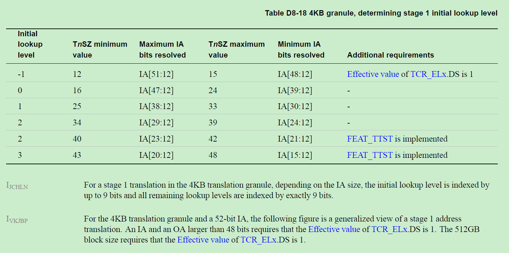
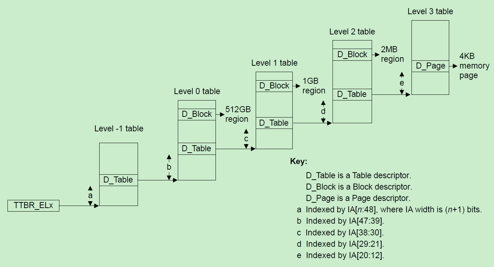
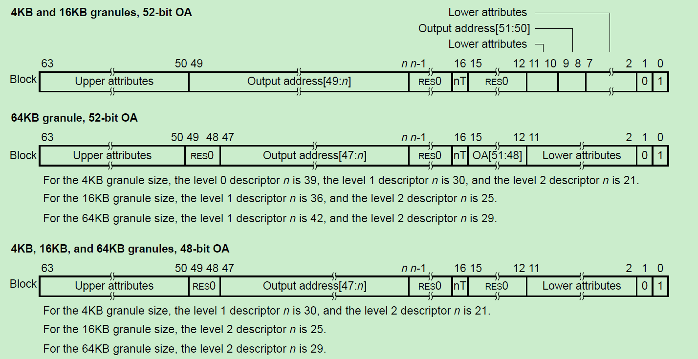
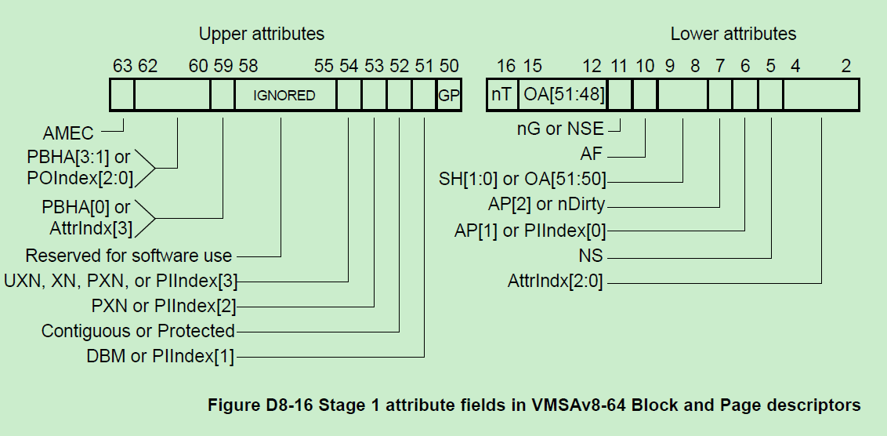
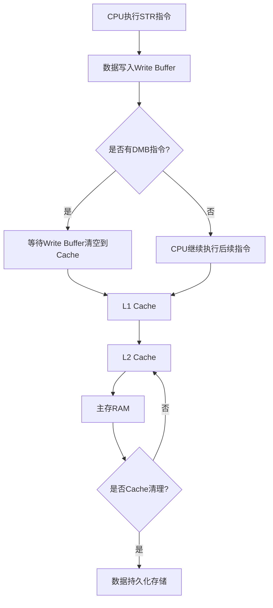

- [前言](#前言)
- [aarch64](#aarch64)
    - [寄存器：](#寄存器)
      - [cache功能项：](#cache功能项)
    - [原子性操作：](#原子性操作)
    - [中断机制](#中断机制)
      - [`Cortex-A9`：](#cortex-a9)
      - [`Cortex-A53`：](#cortex-a53)
    - [MMU](#mmu)
      - [基础知识点](#基础知识点)
        - [页表结构](#页表结构)
          - [特权与非特权](#特权与非特权)
        - [linux相关操作](#linux相关操作)
    - [CPU访问流程](#cpu访问流程)
    - [数据读写流向](#数据读写流向)
- [总结](#总结)

---

# 前言


本文主要描述armv8架构

---

# aarch64 
### 寄存器：

 - 通用寄存器(general-purpose registers)：
有R0~R30 共计31个通用寄存器,x30通常作为LR寄存器
 <div align="center">

<p>图片1.通用寄存器</p>
</div>

 - 栈指针寄存器(`SP`)
 一个64bit栈指针寄存器

 <div align="center">

<p>图片2.SP寄存器</p>
</div>

 - 程序计数寄存器(`PC`)
 一个64bit的程序计数寄存器

 <div align="center">

<p>图片3.PC寄存器</p>
</div>

 - SIMD&FP寄存器(`SIMD&FP`)
 32个128bit的SIMD&FP操作寄存器


 <div align="center">


<p>图片4.SIMD&FP寄存器</p>
</div>

```bash
uint64_t * pinValue = 0x1000;
uint64_t * poutValue = 0x2000;
__asm__ volatile(
"ldnp q0,q1,[%[ValueIn1]]\n"
"stnp q0,q1,[%[ValueOut1]]\n"
:
:[ValueIn1]"r"(pinValue),[ValueOut1]"r"(poutValue)
:"memory","x0"
);
__asm__ volatile(
"ld4 {v0.2d,v1.2d,v2.2d,v3.2d},[%[ValueIn1]]\n"
"st4 {v0.2d,v1.2d,v2.2d,v3.2d},[%[ValueOut1]]\n"
:
:[ValueIn1]"r"(pinValue),[ValueOut1]"r"(poutValue)
:"memory","x0"
);
```

- FPCR, FPSR寄存器(`FPCR, FPSR`)
 2个64bit的SIMD&FP运算状态寄存器，存储SIMD指令及浮点运算过程中的状态

- 可伸缩矢量寄存器(`SVE`)
 32个128bit的SIMD&FP操作寄存器，用于SIMD指令及浮点运算


 <div align="center">

<p>图片4.SIMD&FP寄存器</p>
</div>

#### cache功能项：
 - Cache type寄存器(`Cache Type Register`)
主要功能如下：
	- 任何受指令缓存维护指令影响的指令缓存的最小行长度。
	- 任何受数据缓存维护指令影响的数据或统一缓存的最小行长度。
	- 一级指令缓存的缓存索引和标记策略。

 <div align="center">


<p>图片5.cache type 寄存器</p>
</div>

### 原子性操作：

 - 对齐的LDR、STR为single-copy atomic
   - 单次加载/存储操作不可分割
   - 支持最大64bit数据宽度（8字节）
   - 适用于：指针操作、基本数据类型访问
   - 示例：`LDR X0, [X1]` / `STR X0, [X1]`

 - 对齐的LDNP、STNP为2次single-copy atomic
   - 每次操作实际执行两个独立的8字节访问
   - 支持128bit数据宽度（16字节）
   - 不保证两个8字节操作的原子顺序
   - 适用于：流式数据操作、非关键数据块拷贝
   - 示例：`LDNP Q0, Q1, [X2]` / `STNP Q0, Q1, [X3]`

### 中断机制

```c
ADD R0, R1, R2    ; 假设执行这条指令时触发中断
MOV R3, #1        ; 下一条指令
```
在Cortex-A53/A9中，当执行ADD指令时发生中断：

对ADD指令的处理有**两种**可能：

1.如果ADD已经进入执行阶段(Execute stage)，则会**执行完成**
2.如果ADD还在译码或更早的流水线阶段，则可能会被**取消(canceled)并重新执行**


关于**LR**值的设置：

如果ADD指令被完整执行了，**LR**会指向MOV指令的地址
如果ADD指令被取消了，**LR**会指向ADD指令的地址


这种行为设计的原因是：

保证指令的原子性
确保中断返回后能够正确恢复执行
维护处理器状态的一致性

#### `Cortex-A9`：


采用经典的ARMv7-A架构
支持精确中断机制
使用6-8级流水线
**当中断发生时**：

1. 完成当前指令执行
2. LR = PC - 4（对于IRQ/FIQ，指向MOV）(ps:若未完成时,LR指向ADD指令)
3. 支持虚拟化扩展（可选）

#### `Cortex-A53`：
采用ARMv8-A架构
同样支持精确中断
使用8级流水线
提供了更多的异常等级（EL0-EL3）
**当中断发生时**：

1. 完成当前指令执行
2. LR = PC - 4（在AArch32模式下）
3. 在AArch64模式下，使用ELR_ELx寄存器保存返回地址
4. 支持更复杂的异常处理机制
### MMU

#### 基础知识点

##### 页表结构

在 arm64/cortex-A53下,`MMU`根据**颗粒度**大小(`granule`),将表分为多级，包括**Table**、**Block**(2MB)、**Page**(4KB).最终通过一个**虚拟地址**通过查表获取对应的**物理地址**(虚拟地址不同bit分区作为MMU Table的索引)

EL3_stage1 最多支持5级别页表,最后一个表为**block&page**




**Table Descriptor Format**:





**Lower Attributes [2:15]**

| 位范围    | 字段名       | 含义说明 |
|-----------|--------------|----------|
| [4:2]     | AttrIndx[2:0] | 内存属性索引，对应 MAIR_ELx，定义缓存策略和内存类型（Device/Normal） |
| 5         | NS            | Non-secure bit：标记为安全世界或非安全世界（TrustZone） |
| [7:6]     | AP[1:0]       | 访问权限：用户态/特权态，读/写 权限设置 |
| [9:8]     | SH[1:0]       | 共享域设置：Non-shareable、Inner-shareable、Outer-shareable |
| 10        | AF            | Access Flag：是否已访问（硬件/软件置位） |
| 11        | nG            | not-Global：设置是否是全局页，影响 TLB 是否与 ASID 绑定 |
| [15:12]   | OA[51:48]     | 输出物理地址高位部分（配合页基地址） |


**Upper Attributes [50:63]**

| 位范围    | 字段名            | 含义说明 |
|-----------|-------------------|----------|
| 50        | GP                | Guarded Page（或其他特殊用途，常忽略） |
| 51        | Reserved          | 保留位 |
| 52        | DBM / PI[1]       | Dirty Bit Modify 支持，用户态可写标志 |
| 53        | Contiguous        | 支持页连续优化，用于 TLB 合并 |
| 54        | PXN / PI[2]       | Privileged Execute Never：禁止 EL1 执行 |
| 55        | UXN / PI[3]       | Unprivileged Execute Never：禁止 EL0 执行 |
| [58:56]   | Reserved/Software | 供软件使用或保留 |
| 59        | PBHA[0] / AttrIndx[3] | Page Based Hardware Attributes，平台相关 |
| [62:60]   | PBHA[3:1] / POIndex[2:0] | 同上，QoS / Cache Hint 用 |
| 63        | AMEC              | Allocation Management Enable Code，硬件或平台使用 |

###### 特权与非特权
| 术语               | 中文含义  | 描述                       |
| ---------------- | ----- | ------------------------ |
| **Privileged**   | 特权模式  | 操作系统核心、驱动代码运行的模式，权限最高    |
| **Unprivileged** | 非特权模式 | 用户态程序运行的模式，权限受限，不能直接访问硬件 |

| EL级别 | 运行模式           | 典型用途           | 是否特权模式            |
| ---- | -------------- | -------------- | ----------------- |
| EL3  | Secure Monitor | TrustZone 安全监控 | ✅ 是               |
| EL2  | Hypervisor     | 虚拟化支持          | ✅ 是               |
| EL1  | Kernel / OS    | 操作系统内核         | ✅ 是               |
| EL0  | User Space     | 应用程序           | ❌ 否（Unprivileged） |


| 对比项             | Unprivileged (EL0) | Privileged (EL1+) |
| --------------- | ------------------ | ----------------- |
| 是否能访问系统寄存器      | ❌ 否                | ✅ 是               |
| 是否能修改页表或MMU     | ❌ 否                | ✅ 是               |
| 是否能执行异常处理       | ❌ 否                | ✅ 是               |
| 是否可执行SVC（软件中断）  | ✅ 可以请求服务           | ✅ 可以处理            |
| 是否可执行 `WFI/WFE` | ❌ 否                | ✅ 是               |
| 能否开启/关闭中断       | ❌ 否                | ✅ 是               |
| 常见用途            | 用户程序（shell、APP）    | 内核、驱动、异常处理等       |


总结一句话：
Privileged 是“特权态”用于操作系统和核心控制逻辑；Unprivileged 是“用户态”，用于运行用户应用，受到严格限制，防止破坏系统稳定性。

在**ARM64**上:

- TTBR0_EL1: 指向**用户**空间**页表基地址**
- TTBR1_EL1: 指向**内核**空间**页表基地址**
- 每个进程都有自己的**用户空间页表**(`TTBR0`)
- 所有进程共享同一个**内核页表**(`TTBR1`)

##### linux相关操作

Linux 通常采用四级页表结构:

- PGD (Page Global Directory)
- PUD (Page Upper Directory)
- PMD (Page Middle Directory)
- PTE (Page Table Entry)

```c
页表切换过程
switch_mm() {
    // 1. 获取新进程的页表基地址
    pgd = next->mm->pgd;
    
    // 2. 切换TTBR0寄存器
    write_ttbr0(pgd);
    
    // 3. 刷新TLB
    flush_tlb_local();  // 清除旧进程的TLB项
    
    // 4. 更新ASID(Address Space ID)
    if (prev_asid != next_asid) {
        update_asid(next_asid);
    }
}

```
内存管理的关键概念：

- 每个进程有独立的虚拟地址空间
- 内核空间在所有进程中映射相同
- 使用ASID来避免切换时完全刷新TLB
- 页表项包含访问权限、缓存属性等标志位


### CPU访问流程

**CPU取指令阶段:**


CPU首先获取程序计数器(PC)中的**虚拟地址**
这个**虚拟地址**需要被转换为物理地址才能访问实际的内存


地址转换过程:

- 首先检查`TLB(Translation Lookaside Buffer)`:

    - CPU会先查找TLB缓存
    - TLB条目包含`ASID(Address Space ID)`和虚拟地址到物理地址的映射
    - `ASID`用于区分不同进程的地址空间,避免TLB刷新
    - 如果找到匹配的`TLB`条目(`TLB hit`),直接使用缓存的物理地址

-  TLB未命中时的页表遍历:

    - CPU读取`TTBR(Translation Table Base Register)`获取页表基地址
    - 对于ARM架构通常是两级页表结构
    - 使用虚拟地址的不同位段索引页表
    - 最终得到物理页框号(PFN)


**Cache访问:**


得到物理地址后,先检查Cache
- 现代CPU通常采用`VIPT(Virtually Indexed Physically Tagged)Cache`
- Cache使用虚拟地址的低位作为索引,物理地址作为Tag
- 如果Cache命中,直接返回数据
- Cache缺失则需要访问内存


**实际执行过程中的优化:**


- CPU会进行指令预取,填充指令Cache
- 分支预测会提前计算可能用到的地址
- MMU包含micro-TLB专门用于指令地址转换
- Cache和TLB并行查询以提高性能

**这个过程涉及几个关键组件的协同工作:**

- ASID确保每个进程有独立的地址空间视图
- TTBR指向当前进程的页表结构
- TLB缓存最近使用的地址转换结果
- Cache系统隐藏内存访问延迟

**当进程切换时:**

- 需要更新TTBR指向新进程的页表
- 可能需要刷新TLB(除非使用ASID)
- Context Switch会影响Cache性能

**这些机制共同保证了虚拟内存的正确性和性能。每个组件都针对特定问题提供优化:**

- ASID解决进程隔离问题
- TLB解决地址转换速度问题
- Cache解决内存访问延迟问题


MMU中可配置cache属性。某块RAM配置了cacheable属性，若存放了指令，则会使用Icache，若触发了访问，则会使用Dcache。


### 数据读写流向



数据流向说明：

- **CPU执行STR指令阶段**：
  - 数据首先进入Write Buffer（合并缓冲区）
  - 处理器继续执行后续指令（非阻塞）
  - 写操作完成状态立即对当前CPU可见

- **Write Buffer到Cache阶段**：
  - 异步写入L1 D-Cache（由硬件调度）
  - 写入策略：
    - 默认：合并相邻写操作（Write Merging）
    - 遇到DMB指令：强制排空Write Buffer
    - 遇到DSB指令：确保数据到达目标存储位置

- **Cache层级同步**（Write-Back策略）：
  ```mermaid
  flowchart LR
    L1D-->|Eviction|L2
    L2-->|Eviction|L3
    L3-->|Eviction|RAM
  ```
  - 触发条件：
    - Cache替换策略触发（LRU等）
    - 显式Clean/Invalidate操作
    - 一致性协议请求（如多核间缓存一致性）

带内存屏障的写操作：
```c
STR R1, [R0]    // 1. 数据进入Write Buffer
DMB             // 2. 确保所有存储操作在继续前完成
                // 3. 清空Write Buffer到L1 D-Cache
```


带Cache清理的写操作：
```c
STR R1, [R0]    // 1. 数据进入Write Buffer
DSB             // 2. 等待所有存储完成（包括Cache到内存）
DC CIVAC, X0    // 3. 清理并无效化Cache行（ARMv8指令）
```

对开发者的影响：
- **常规场景**：
  - 利用Write Buffer提升性能
  - 自动缓存管理
  
- **关键场景**：
  - DMA操作前：必须Clean Cache
  - 多核共享数据：需要DMB+Cache维护
  - 内存映射I/O：使用Device-nGnRnE内存类型

# 总结
