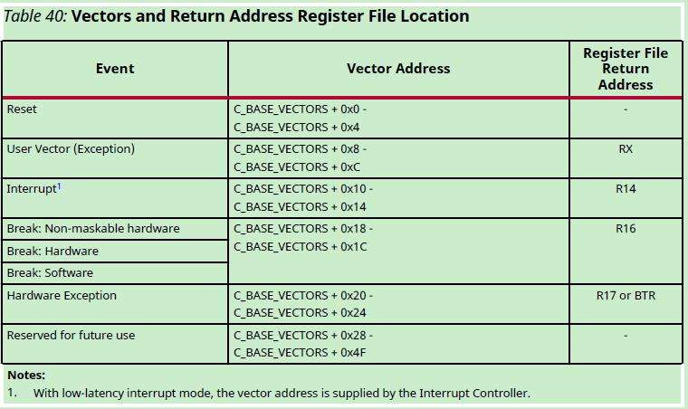

---
- [前言](#前言)
- [一、GCC](#一gcc)
  - [ARM](#arm)
    - [语法](#语法)
      - [marco](#marco)
      - [rept](#rept)
      - [section](#section)
      - [.extern](#extern)
      - [.set](#set)
      - [.align](#align)
      - [.org](#org)
    - [专业名词](#专业名词)
      - [Post-index](#post-index)
      - [Pre-Index](#pre-index)
    - [指令](#指令)
      - [adr\_l](#adr_l)
      - [move](#move)
      - [STP](#stp)
      - [DC](#dc)
      - [DMB(Data Memory Barrier)](#dmbdata-memory-barrier)
      - [LDMIA(Load Multiple Increment After)](#ldmiaload-multiple-increment-after)
      - [STMIA(Store Multiple Increment After)](#stmiastore-multiple-increment-after)
      - [LDXR](#ldxr)
      - [STXR](#stxr)
    - [启动过程](#启动过程)
      - [main、\_main、\_start](#main_main_start)
  - [MicroBlaze](#microblaze)
    - [惯例](#惯例)
      - [stack pointer( r0 )](#stack-pointer-r0-)
      - [stack pointer( r1 )](#stack-pointer-r1-)
      - [中断向量表](#中断向量表)
    - [语法](#语法-1)
      - [la](#la)
      - [sw](#sw)
      - [lhu](#lhu)
      - [shi](#shi)
- [二、IAR](#二iar)
      - [汇编](#汇编)
      - [扩展内联汇编](#扩展内联汇编)
      - [IAR汇编帮助文档](#iar汇编帮助文档)
- [三、KEIL](#三keil)
- [四、链接脚本](#四链接脚本)


---

# 前言


使用不同的编译器，指导编译器编译链接的文件**lds**稍许不一样，现在分arm-linux-gnueabi-gcc、IAR、Keil分开记录

---

`提示：以下是本篇文章正文内容，下面案例可供参考`

# 一、GCC
## ARM
###  语法
#### marco
`macro`为定义一个宏，`.macro`为首，`.endm`为尾，。
在其他文件调用此宏定义，即可用定义的代码段替换宏。下面是一个宏定义示例。
```handlebars
.macro CPWAIT reg
	mrc	p15, 0, \reg, c2, c0, 0
	mov	\reg, \reg
	sub	pc, pc, #4
.endm
```

#### rept
在汇编语言中，`rept` 和 `endr` 通常是用于创建重复的代码块（重复宏）。`rept` 指令用于开始一个重复块，然后可以在其中重复执行一段代码，直到遇到 `endr` 指令为止。这样可以方便地生成重复的汇编代码。

例如，以下是一个使用 `rept` 和 `endr` 的示例：


```handlebars

.section .mmutable, "a"
mmutable:
	.align	14
	/* 0x00000000 - 0xffe00000 : 1:1, uncached mapping */
	.set	__base, 0
	.rept	0xfff
	.word	(__base << 20) | 0xc12
	.set	__base, __base + 1
	.endr

	/* 0xfff00000 : 1:1, cached mapping */
	.word	(0xfff << 20) | 0x1c1e

```

在上面的示例中，`rept 0xfff` 表示下面的代码块将被重复执行 0xfff 次，然后 `endr` 表示重复块的结束。因此，其中的代码会被复制和粘贴 0xfff 次,作用就是建立了一张`mmu`表。

#### section
`.section` 是汇编语言中的一个指令，通常用于将汇编代码分组为不同的节（sections）。在汇编器中，节是指代码或数据的逻辑分区，用于将不同类型的内容分开存放。每个节可以包含代码、数据、常量等不同类型的信息。

在大多数汇编语言中，`.section` 指令用于创建不同类型的节，并且可以指定节的属性和名称。具体的语法和属性取决于所使用的汇编器和体系结构。

以下是一个示例，展示了在某些汇编语言中使用 `.section` 的方式：

```assembly
.section .data
    data_value: .word 42

.section .text
    .global main
main:
    mov r0, r1
    bx lr
```

在这个示例中，`.section .data` 表示接下来的代码将位于名为 `.data` 的节中，这通常用于存放数据。`.section .text` 表示接下来的代码将位于名为 `.text` 的节中，这通常用于存放指令代码。结合`lds`文件，便可以把section存放在指定区域了。

#### .extern

.extern用于在汇编文件中声明外部变量


#### .set

在GCC中，`.set `汇编伪指令用于为汇编代码中的符号（如标签或变量）分配一个特定的数值。这通常用于在汇编代码中定义常数或指定地址。(ps:相当于c语言中的宏定义`#define`)

```c
.set BUFFER_SIZE, 100
```
以上是一个示例，假设你要在汇编代码中定义一个名为 BUFFER_SIZE 的常数，其大小为 100。然后，在你的汇编代码中，你可以使用 BUFFER_SIZE 而不必在每个地方使用数字 100。

#### .align

```c
//.align 指令的一般形式是
.align <alignment>

// 对齐到4字节边界
.align 2

// 对齐到8字节边界
.align 3

// 对齐到16字节边界
.align 4

```
其中，<alignment> 表示要对齐的边界，通常是2的幂。例如，.align 4 将当前位置对齐到4字节边界，.align 8 将当前位置对齐到8字节边界，以此类推。
#### .org
`.org` 是一种汇编伪指令，通常用于设置程序计数器（PC）或地址计数器（AC），以指示汇编器生成的代码或数据应该放置在特定的内存地址或位置。这在编写汇编程序时非常有用，因为它允许你控制生成的二进制代码的位置。

例如，假设你正在编写一个汇编程序，想要将一段代码放置在内存的地址0x1000处，你可以使用以下指令：

```c
.org 0x1000
//后续跟随代码块，即生成在0x1000位置
```

### 专业名词
#### Post-index 
`Post-index` 是一种内存地址计算方式，它表示在访问内存后，将索引添加到基地址。这是在ARM汇编语言中的一种寻址模式，通常与加载（Load）和存储（Store）指令一起使用。

以下是一个示例，使用 Post-indexing 进行加载操作的 ARM 汇编代码：
```c
ldr x0, [x1], #4
```
在这个例子中：

`ldr `是 Load 指令，用于从内存中加载数据到寄存器。
`x0 `是目标寄存器，用于存储加载的数据。
`[x1], #4` 是 `Post-index` 寻址模式。它表示从存储器地址 x1 处加载数据到 x0，然后将 x1 的值增加 4 个字节（32位）。
这个指令的效果是，首先加载 x1 指向的内存位置的数据到 x0，然后将 x1 的值增加 4，使其指向下一个数据元素。（ps :类似于c语言中的i++中的++）
#### Pre-Index
`Pre-indexing` 是一种内存地址计算方式，与 Post-indexing 相对，它表示在访问内存之前将索引添加到基地址。在ARM汇编语言中，Pre-indexing通常与加载（Load）和存储（Store）指令一起使用。

以下是一个使用 Pre-indexing 进行加载操作的 ARM 汇编代码示例：

```c
ldr x0, [x1, #4]!
```
在这个例子中：

ldr 是 Load 指令，用于从内存中加载数据到寄存器。
x0 是目标寄存器，用于存储加载的数据。
[x1, #4]! 是 Pre-indexing 寻址模式。它表示将 x1 的值增加 4 个字节（32位）后，再从存储器地址 x1 处加载数据到 x0。
这个指令的效果是，在访问内存之前，将 x1 的值增加 4，然后加载这个新地址处的数据到 x0。

---

### 指令

#### adr_l

```bash
adr_l x0, boot_args    
// 实际执行时：
// 1. 计算：absolute_addr = PC + offset_to_boot_args
// 2. x0 = absolute_addr

// 假设：
// PC = 0x80000000
// boot_args 相对 PC 偏移 = 0x1000

adr_l x0, boot_args    // x0 = 0x80000000 + 0x1000 = 0x80001000
stp x21, x1, [x0]      // 使用物理地址 0x80001000 进行存储
```

```c
假设：

当前 PC = 0x80000000
previous_data 在 PC 的偏移为 -0x1000
那么 ADR_L 指令会计算地址如下：
x0 = PC + offset_to_previous_data
x0 = 0x80000000 - 0x1000
x0 = 0x7FFFF000

```

#### move

```c
mov 目的操作数, 源操作数

```

#### STP 

```c
STP <Xt1>, <Xt2>, [<Xn|SP> {,#imm}]

- STP：Store Pair，将两个 64 位寄存器一起存入内存。
- <Xt1>, <Xt2>：两个源寄存器（这里是 X0 和 X1），要保存的内容。
- [SP, #-0x10]：带偏移量的地址，是目标内存地址，偏移 -0x10 字节（即 -16）。
- 隐式使用了 Pre-index addressing mode，即写入内存后，SP 会被更新为 SP - 0x10。
```
执行步骤：
 - 将当前 SP 减少 0x10（16 字节），即：

```asm
SP = SP - 0x10
```
 - 把 X0 的值写入新的 [SP]（偏移 0），

 - 把 X1 的值写入 [SP + 8]。
#### DC
无效数据缓冲(`data cache`)

```c
根据VA，无效指定区域data cache
#include <stdint.h>
#include <stddef.h>

// ARM Cortex-A53 的缓存行大小（通常为 64 字节）
#define CACHE_LINE_SIZE 64

/**
 * 无效化指定范围内的缓存内容。
 * @param start_va 起始虚拟地址
 * @param size 需要无效的缓存范围大小（字节数）
 */
void invalidate_cache_range(uintptr_t start_va, size_t size) {
    uintptr_t end_va = start_va + size; // 计算结束地址

    // 循环处理每一行缓存
    for (uintptr_t addr = start_va; addr < end_va; addr += CACHE_LINE_SIZE) {
        asm volatile (
            "dc ivac, %0\n"   // 无效化指定虚拟地址的缓存行
            :
            : "r" (addr)
            : "memory"
        );
    }

    // 确保所有缓存操作完成
    asm volatile (
        "dsb ish\n"  // 数据同步屏障，确保无效化操作完成
        "isb\n"      // 指令同步屏障，确保内存视图一致
        :
        :
        : "memory"
    );
}

```
#### DMB(Data Memory Barrier)
内存屏障指令，提供屏障，用于数据同步(乱序执行&多核)

```c
STR R0, [R1]    ; 核心 1 写入共享变量
DMB             ; 确保写入操作完成
SEV             ; 通知其他核心

```

 <div align="center">

<p>图片.DMB指令参数详解</p>
</div>


#### LDMIA(Load Multiple Increment After)
`LDMIA`是 **Load Multiple Increment After**（多寄存器加载，地址递增），用于从内存加载多个寄存器。

```bash
@ 指令标准格式
LDMIA <Rn>!, {<Rlist>}
```
- **`LDMIA`**：Load Multiple Increment After（多寄存器加载，地址递增）。
- **`Rn`**：基址寄存器，指向要加载的内存地址。
- **`Rlist`**：要加载的多个寄存器。
- **`!`**（可选）：表示**写回**，即更新 <Rn> 的值。

```bash
@ 实例代码
LDMIA r4!, {r7 - r10}
```

- **`r4`** 是基址寄存器，指向要加载的数据地址。
- **`{r7 - r10}`** 指定要加载的寄存器：
读取 4 个寄存器（r7, r8, r9, r10），每个 4 字节，共 16 字节。
- **`!`** 表示写回：
r4 递增 16（每个寄存器 4 字节，4 个寄存器 = 16 字节）。

假如：
`r4 = 0x1000`，指向内存地址 `0x1000`。
内存数据如下：
```bash
0x1000:  0xAAAAAAA1   ; 4字节
0x1004:  0xBBBBBBB2   ; 4字节
0x1008:  0xCCCCCCC3   ; 4字节
0x100C:  0xDDDDDDD4   ; 4字节
```

执行 `LDMIA r4!, {r7 - r10}`：

`r7` = `0xAAAAAAA1`
`r8` = `0xBBBBBBB2`
`r9` = `0xCCCCCCC3`
`r10` = `0xDDDDDDD4`
`r4` = `r4 + 16 = 0x1010`（地址递增 16）
#### STMIA(Store Multiple Increment After)
**`STMIA`** 是 "Store Multiple Increment After"（多寄存器存储，地址递增），用于将多个寄存器的值存入内存。
```bash
@ 指令标准格式
STMIA <Rn>!, {<Rlist>}
```
- **`STMIA`**：**Store Multiple Increment After**（多寄存器存储，地址递增）。
- **`Rn`**：基址寄存器，指向存储目标地址。
- **`Rlist`**：要存入的多个寄存器。
- **`!`**（可选）：表示写回，即更新 <Rn> 的值。

```bash
@ 实例代码
STMIA r5!, {r7 - r10}
```

- **`r5`** 是基址寄存器，指向目标地址（内存地址）。
- **`{r7 - r10}`** 指定要存储的寄存器：
存储 4 个寄存器（r7, r8, r9, r10），每个 4 字节，共 16 字节。
- **`!`** 表示写回：
r5 递增 16（每个寄存器 4 字节，4 个寄存器 = 16 字节）。

假设：

`r5` = 0x2000，指向目标地址 0x2000。
寄存器数据如下：

r7  = 0xAAAAAAA1<br>
r8  = 0xBBBBBBB2<br>
r9  = 0xCCCCCCC3<br>
r10 = 0xDDDDDDD4<br>
执行 `STMIA r5!, {r7 - r10}`：<br>

r7 → [0x2000] = 0xAAAAAAA1<br>
r8 → [0x2004] = 0xBBBBBBB2<br>
r9 → [0x2008] = 0xCCCCCCC3<br>
r10 → [0x200C] = 0xDDDDDDD4<br>
`r5 = r5 + 16 = 0x2010`（地址递增 16）<br>


#### LDXR
#### STXR

Armv8 使用同步原语提供共享内存的非阻塞同步。本节中关于同步原语的内存访问信息，适用于对**普通内存**（Normal memory）和任何类型的**设备内存**（Device memory）的访问

 <div align="center">

<p>图片.LDXR STXR</p>
</div>

除显示`CLREX`指令的那一行外，单行中的两条指令是一对独占加载/独占存储指令。一对独占加载/独占存储指令访问一个非中止的内存地址`x`的模型是：

- 独占加载指令从内存地址`x`读取一个值。

- 相应的独占存储指令只有在**没有其他观察者**、**进程**或**线程**对地址`x`执行了**更近期的存储**时，才能成功地写入该内存地址。独占存储指令返回一个状态位，该状态位指示写内存操作是否成功。

### 启动过程

#### main、_main、_start

 1. `main` 是用户程序的入口点，按照 C/C++ 标准，是程序的执行起点。开发者通常会在 main 中实现应用程序的主要逻辑。
 2. `_main` 通常是运行时库（C runtime, CRT）中提供的一个内部函数，负责完成以下任务：

	- 初始化运行时环境，例如堆栈、全局变量、静态变量、动态内存分配（如 malloc）。
	- 调用用户定义的 main 函数。
	- 在 main 返回后，处理程序退出的清理工作（例如调用 exit 或 _exit）。
	
	_main 的代码一般由标准库或启动代码（startup code）提供，开发者通常无需直接使用它
 3. 在大多数 ARM 编译工具链中（如 GCC、Clang），链接器会将程序入口设置为 `_start` 或 `__start`（具体取决于架构和配置），这个入口通常由启动代码定义。

## MicroBlaze


### 惯例

#### stack pointer( r0 )
默认作为0寄存器

#### stack pointer( r1 )

默认使用R1作为栈指针

#### 中断向量表
 <div align="center">

<p>中断向量表</p>
</div>


### 语法

#### la
```asm
la r6, r0, __FreeRTOS_interrupt_handler

la = Load Address（加载地址）
将 __FreeRTOS_interrupt_handler 函数的地址加载到寄存器 r6 中
r0 作为基址寄存器（在 MicroBlaze 中 r0 通常为 0）
```

#### sw
```asm
sw r6, r1, r0

sw = Store Word（存储字）
将 r6 中的地址（中断处理程序地址）存储到内存位置 [r1 + r0] 中
r1 通常是栈指针，这里可能指向中断向量表的位置
```

#### lhu
```asm
lhu r7, r1, r0

lhu = Load Half-word Unsigned（加载无符号半字）
从内存位置 [r1 + r0] 加载一个 16 位的无符号值到 r7 中
这可能是在读取之前存储的中断向量的一部分
```

#### shi

```asm
shi r6, r0, 0x16

shi = Store Half-word Immediate（立即存储半字）
将 r6 中的值（中断处理程序地址的低 16 位）存储到内存地址 [r0 + 0x16] 中
0x16 是另一个立即数偏移量
```
# 二、IAR

#### 汇编
|  关键字|详解|
|--|--|
|section|section关键字一般放在s文件首部,它的一般形式如下**SECTION .vectors:CODE:NOROOT(2)**,section代表一个段的开始，.vector代表段名，后面跟的是属性，具体含义要参考文档 |
|PUBLIC|将本文件的函数做外部声明，声明之后可在c函数中调用，如Assembly_causeUndefine函数即可在c文件中调用
|EXTERN|声明一个外部函数，然后可在本文件中调用，如在c文件中实现了一个PrintHello，可在本文件中调用|
 

#### 扩展内联汇编

```c
//内敛汇编基本格式
asm ( assembler template
        : output operands                /*在MOV R0,R1中,R1->R0,R0为output*/
        : input operands                 /*在MOV R0,R1中,R1->R0,R1为input*/
        : list of clobbered registers   /* optional */
);
```
**output operands**和**input operands**分别代表输入输出函数
**clobbered registers**指明修改的寄存器或者内存，如果某个指令改变了某个寄存器的值，我们就必须在asm中第三个冒号后的Clobber List中标示出该寄存器。为的是通知GCC，让其不再假定之前存入这些寄存器中的值依然合法。输入输出寄存器不用放Clobber List中，因为GCC能知道asm将使用这些寄存器。(因为它们已经显式被指定输入输出标出在输入输出部分) 。其他使用到的寄存器，无论是显示还是隐式的使用，必须在clobbered list中标明。


```c
//具体代码
void print_r0r1(int r0, int r1,int r2,int r3)
{
    int value,addr;
    fmsh_print("r0 0x%x r1 0x%x\n",r0,r1);
    register uint64_t addr, value;
	asm volatile (
	    "MOV %[op1], SP\n"
	    "LDR %[op2], [SP]\n"
	    : [op1]"=r"(addr), [op2]"=r"(value)   // ✅ 输出约束，加上 =
	    :                                     // ❌ 没有输入
	    : "memory"                            // ✅ 防止内存相关优化
	);

    fmsh_print("SP addr 0x%x value 0x%x\n",addr,value);
}


// 32 位写操作
void write32(uint32_t value, volatile uint32_t *address) {
    __asm__ __volatile__(
        "str %w[value], [%[addr]]"
        : : [value] "r" (value), [addr] "r" (address)
        : "memory"
    );
}

// 32 位读操作
uint32_t read32(volatile uint32_t *address) {
    uint32_t result;
    __asm__ __volatile__(
        "ldr %w[result], [%[addr]]"
        : [result] "=r" (result)
        : [addr] "r" (address)
        : "memory"
    );
    return result;
}

```

```c
//如果你希望失效一个变量的地址，可以在 C 代码中结合内嵌汇编：
#include <stdio.h>

int main() {
    int x = 42;  // 定义一个变量
    uintptr_t address = (uintptr_t)&x;  // 获取变量地址

    // ARM 汇编中使用 DC IVAC
    __asm__ volatile(
        "MOV x0, %0\n"    // 将 address 加载到寄存器 x0
        "DC IVAC, x0\n"   // 使缓存行失效
        :
        : "r"(address)    // 将变量地址传递给汇编
        : "x0"            // 声明汇编会使用 x0
    );

    return 0;
}

#include <stdio.h>

int main() {
    // ARM 汇编中使用固定地址 0x200400
    __asm__ volatile(
        "MOV x0, #0x200000\n" // 将高地址部分加载到 x0
        "ORR x0, x0, #0x400\n" // 将低地址部分加载到 x0
        "DC IVAC, x0\n"        // 使用 x0 执行缓存行失效指令
        :
        :
        : "x0"                 // 声明汇编中使用了 x0
    );

    printf("Cache line invalidation for address 0x200400 completed.\n");
    return 0;
}
**********************************************************************************
#include <stdio.h>

int main() {
    // ARM 汇编中使用固定地址 0x200400
    __asm__ volatile(
        "MOV x0, #0x200000\n" // 将高地址部分加载到 x0
        "ORR x0, x0, #0x400\n" // 将低地址部分加载到 x0
        "DC IVAC, x0\n"        // 使用 x0 执行缓存行失效指令
        :
        :
        : "x0"                 // 声明汇编中使用了 x0
    );

    printf("Cache line invalidation for address 0x200400 completed.\n");
    return 0;
}

```
| 类型  | 语法                           | 示例                    | 说明              |
| --- | ---------------------------- | --------------------- | --------------- |
| 输出  | `: [name] "=r"(var)`         | `: [x] "=r"(out_var)` | 汇编结果写入 `var`    |
| 输入  | `: : [name] "r"(var)`        | `: : [x] "r"(in_var)` | 把 `var` 的值传给汇编  |
| 破坏项 | `: : : "memory", "cc", "x0"` |                       | 表示影响内存、条件码、寄存器等 |


#### IAR汇编帮助文档
在IAR IDE内，如下图操作，可获得IAR提供汇编指导文档


---

# 三、KEIL
---


# 四、链接脚本
https://sourceware.org/binutils/docs/ld/Scripts.html#Scripts

相关参考资料：
https://www.jianshu.com/p/1782e14a0766